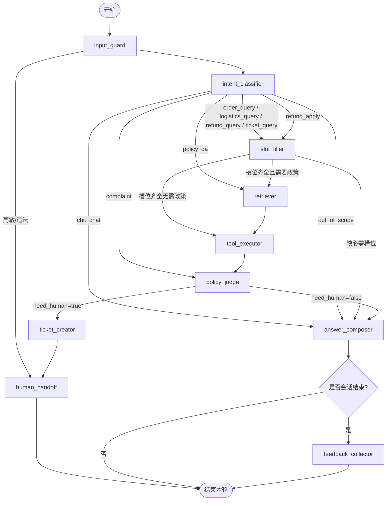
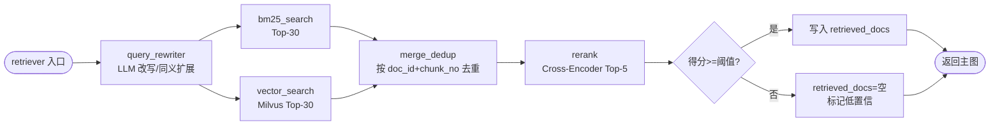
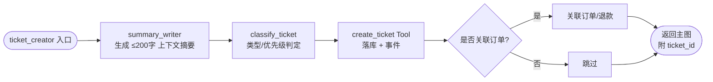
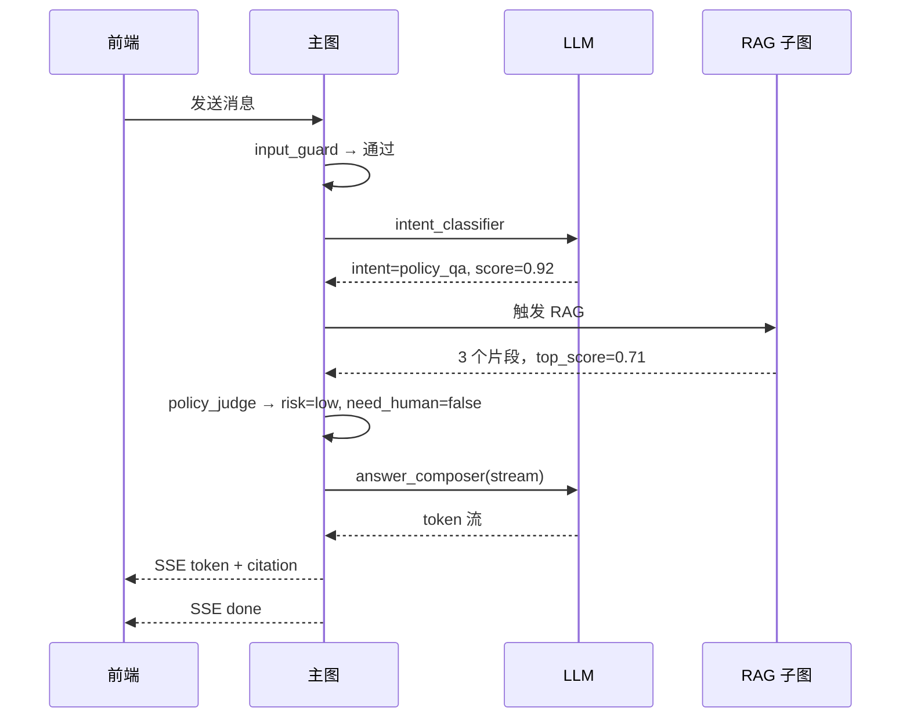
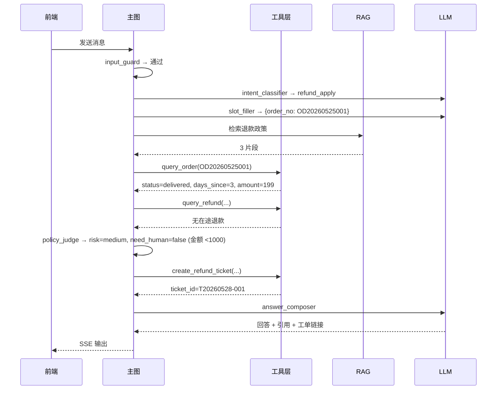
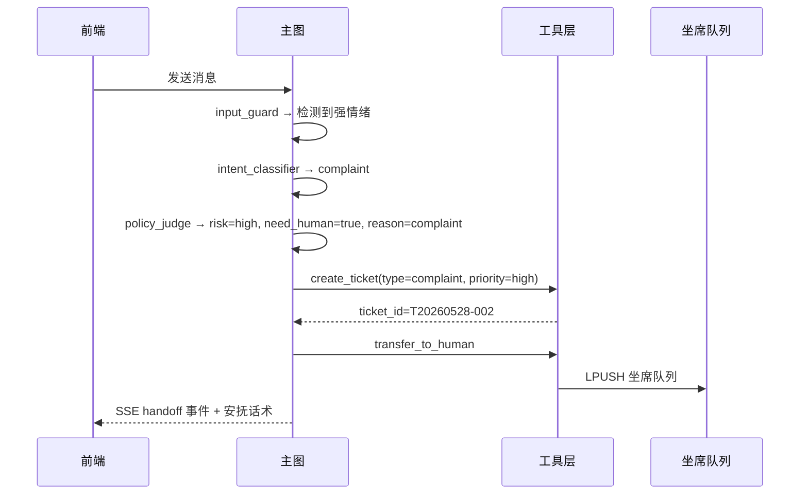

# Agent 工作流文档

> 项目：面向电商售后场景的智能客服工单 Agent 系统
> 文档版本：v1.0
> 最近更新：2026-05-28
> 文档负责人：AI 应用架构组

## 修订记录

| 版本 | 日期       | 修订人 | 修订说明                                                            |
| ---- | ---------- | ------ | ------------------------------------------------------------------- |
| v1.0 | 2026-05-28 | 架构组 | 初稿，定义 AgentState、10 节点主图与兜底策略。                       |
| v1.1 | 2026-05-28 | 架构组 | 收敛到 MVP：节点标注 MVP 必需/可降级；补充与闭环 11 步的映射。 |

## 目录

- [1. 设计哲学](#1-设计哲学)
- [2. AgentState 状态定义](#2-agentstate-状态定义)
- [3. 节点清单与职责](#3-节点清单与职责)
- [4. 主图](#4-主图)
- [5. 子图](#5-子图)
- [6. 工具清单（Tool Calling Schema）](#6-工具清单tool-calling-schema)
- [7. Prompt 模板规范](#7-prompt-模板规范)
- [8. 高风险 / 低置信度 / 投诉的兜底策略](#8-高风险--低置信度--投诉的兜底策略)
- [9. 失败重试与超时策略](#9-失败重试与超时策略)
- [10. 案例走查](#10-案例走查)

---

## 1. 设计哲学

本项目的 Agent 不是"用户问什么就让 LLM 想办法回答"，而是**业务驱动**的 Agent 子系统。具体体现：

1. **节点显式建模**：用户意图、槽位、检索、工具调用、风险判定、回答合成、人工兜底各自独立，便于单独测试与替换。
2. **风险优先**：投诉、低置信、高金额、用户主动要求一律走人工兜底，不靠 LLM 自由决策。
3. **工具不是给 LLM 自由决定的**：在每个分支里，预先确定能调哪几个工具与调用顺序，避免 ReAct 黑盒。
4. **回答必须有"证据"**：政策类问题必须给出 RAG 引用；订单类问题必须基于工具结果。
5. **可中断 / 可恢复**：通过 LangGraph 的 checkpoint 与 SSE，会话可以在任何节点暂停（如转人工），后续可恢复。

## 2. AgentState 状态定义

`AgentState` 是 LangGraph 的全局状态对象，所有节点接收 `state` 并返回 `partial_state` 进行合并。

### 2.1 字段定义

| 字段              | 类型                  | 说明                                                                                  |
| ----------------- | --------------------- | ------------------------------------------------------------------------------------- |
| `trace_id`        | `str`                 | 全链路追踪 ID，会话级唯一。                                                            |
| `tenant_id`       | `str`                 | 租户 ID（MVP 阶段默认值）。                                                            |
| `session_id`      | `str`                 | 会话 ID。                                                                              |
| `user_id`         | `str`                 | 用户 ID。                                                                              |
| `messages`        | `list[Message]`       | 历史消息列表（user / assistant / tool / system），按时间升序。                          |
| `user_input`      | `str`                 | 本轮用户输入（已脱敏 / 已审查）。                                                       |
| `intent`          | `Intent`              | 意图分类结果，枚举见下表。                                                              |
| `intent_score`    | `float`               | 意图置信度（0~1）。                                                                    |
| `slots`           | `dict[str, Any]`      | 抽取出的槽位（订单号、时间范围、商品 ID 等）。                                          |
| `retrieved_docs`  | `list[RetrievedChunk]` | RAG 返回的引用片段（含 doc_title / chunk_no / score / text）。                          |
| `tool_calls`      | `list[ToolCallRecord]` | 本轮执行过的工具调用记录（入参、出参、耗时、是否成功）。                                |
| `tool_results`    | `dict[str, Any]`      | 工具结果归一化后的业务对象（如 `order`、`logistics`、`refund`、`ticket`）。              |
| `risk_level`      | `RiskLevel`           | 风险等级：`low` / `medium` / `high`。                                                  |
| `confidence`      | `float`               | 当前回答候选的整体置信度（0~1）。                                                       |
| `need_human`      | `bool`                | 是否需要人工接管。                                                                     |
| `handoff_reason`  | `str`                 | 转人工原因枚举：`complaint` / `low_confidence` / `tool_failure` / `user_request` / `policy_violation`。 |
| `ticket_id`       | `str \| None`         | 本会话关联的工单 ID（若已创建）。                                                       |
| `answer`          | `str`                 | 最终生成的回答文本。                                                                   |
| `citations`       | `list[Citation]`      | 回答引用列表。                                                                         |
| `error`           | `ErrorInfo \| None`   | 上一节点错误信息（用于条件边）。                                                       |
| `metrics`         | `dict[str, Any]`      | 节点耗时、Token 数等指标。                                                              |

### 2.2 意图枚举

| Intent             | 说明                       | 关联工具                                          |
| ------------------ | -------------------------- | ------------------------------------------------- |
| `order_query`      | 订单状态查询。             | `query_order`                                     |
| `logistics_query`  | 物流进度查询。             | `query_logistics`                                 |
| `refund_query`     | 退款状态查询。             | `query_refund`                                    |
| `refund_apply`     | 退款 / 退货申请。          | `query_order` + `query_refund` + `create_refund_ticket` |
| `policy_qa`        | 售后政策咨询（纯 RAG）。   | RAG 检索器                                        |
| `ticket_query`     | 工单状态查询。             | `query_ticket`                                    |
| `complaint`        | 投诉。                     | `create_ticket` + `transfer_to_human`             |
| `chit_chat`        | 闲聊 / 寒暄。              | 仅 LLM，不调用业务工具                            |
| `out_of_scope`     | 越界（非售后类）。         | 拒答模板                                          |

## 3. 节点清单与职责

主图共 10 个核心节点，每个节点对应 `backend/app/agents/nodes/` 下的一个独立文件。

### 3.0 节点 MVP 范围与降级方案

| 节点                 | MVP 范围 | 闭环步骤   | 降级方案（MVP 时允许简化的实现）                                                       |
| -------------------- | -------- | ---------- | -------------------------------------------------------------------------------------- |
| `input_guard`        | MVP 必需 | 步骤 1     | 黑名单关键词 + 长度截断 + 正则脱敏即可，不引入第三方内容审核。                          |
| `intent_classifier`  | MVP 必需 | 步骤 2     | 单次 LLM 调用 + 严格 JSON 输出；无需在线学习/微调。                                    |
| `slot_filler`        | MVP 必需 | 步骤 2-3   | 单次 LLM 调用；时间词使用 `dateparser` 库归一化即可。                                  |
| `retriever`          | MVP 必需 | 步骤 3     | BM25 用 MySQL FULLTEXT；Rerank 模型可用 BGE-Reranker 本地推理；改写 LLM 失败 → 用原 query。 |
| `tool_executor`      | MVP 必需 | 步骤 3     | 工具函数直连 service 层；不引入异步任务队列。                                          |
| `policy_judge`       | MVP 必需 | 步骤 4     | MVP 阶段用规则 + 阈值即可（见 [§8.1 触发矩阵](#81-触发条件矩阵)），不必单独走 LLM。     |
| `answer_composer`    | MVP 必需 | 步骤 5     | 单次 LLM 流式生成；引用回填使用模板拼接。                                              |
| `ticket_creator`     | MVP 必需 | 步骤 6     | 摘要可与回答合成共用一次 LLM 调用，减少成本。                                          |
| `human_handoff`      | MVP 必需 | 步骤 6     | 仅做 Redis LPUSH + SSE 推送，**不外发邮件 / IM 通知**（推迟至 V1.1）。                  |
| `feedback_collector` | MVP 必需 | 步骤 8-9   | 仅在用户主动 / 会话超时结束时弹卡片；候选知识仅做"未脱敏内容 + 待审核"标记。           |

> 没有任何节点会被推迟到 MVP 之后——10 个节点都是闭环必需。MVP 阶段降级只发生在**节点内部实现**上，节点接口与状态字段保持稳定。

### 3.1 `input_guard` — 输入审查与脱敏

**职责**：

- 长度截断：默认 1000 字符；
- 黑名单短语过滤（"忽略以上指令"、"扮演"、"DAN" 等 prompt 注入模式）；
- PII 识别与脱敏（手机号、地址、订单号、身份证号）；
- 高敏内容直接走 `human_handoff`（如自残、违法）。

**输出更新**：`user_input`、`metrics.input_guard_ms`。

### 3.2 `intent_classifier` — 意图识别

**职责**：

- 使用 LLM（小模型即可）做多分类，输出意图与置信度；
- 置信度低于阈值（默认 0.6）→ 标记 `intent = out_of_scope` 走兜底；
- 用历史消息做上下文（最近 6 轮）。

**输出更新**：`intent`、`intent_score`。

### 3.3 `slot_filler` — 槽位抽取

**职责**：

- 根据 `intent` 决定要抽哪些槽位；
- 缺槽且必需 → 让 `answer_composer` 进入"反问模式"；
- 时间词标准化（"昨天" → ISO 日期范围）；
- 订单号格式校验。

**输出更新**：`slots`。

### 3.4 `retriever` — RAG 检索

**职责**：

- 触发条件：意图属于 `policy_qa` 或 `refund_*`、`complaint` 等需要政策依据的场景；
- 执行 RAG 子图（详见 [§5.1](#51-rag-子图)）；
- 检索置信度（重排最高分）低于阈值（默认 0.4）→ 后续 `policy_judge` 倾向走人工。

**输出更新**：`retrieved_docs`。

### 3.5 `tool_executor` — 业务工具调用

**职责**：

- 根据 `intent` 与 `slots` 构造 ToolCall（不让 LLM 自由决定调哪个工具）；
- 调用一个或多个工具，记录 `tool_calls`；
- 工具失败处理：最多重试 2 次（详见 [§9](#9-失败重试与超时策略)）；
- 工具结果归一化写入 `tool_results`。

**输出更新**：`tool_calls`、`tool_results`、可能更新 `error`。

### 3.6 `policy_judge` — 风险与置信度判定

**职责**：

综合下列信号决定 `risk_level` / `confidence` / `need_human` / `handoff_reason`：

| 信号                                      | 判定                                                    |
| ----------------------------------------- | ------------------------------------------------------- |
| `intent == complaint`                     | `risk_level = high`, `need_human = true`                |
| `tool_results.refund.amount >= 1000`      | `risk_level = high`, `need_human = true`                |
| `tool_calls` 中存在失败                    | `need_human = true`, reason = `tool_failure`            |
| `retrieved_docs` 最高分 < 0.4              | `confidence = low`, reason = `low_confidence`           |
| `intent_score < 0.5`                       | `confidence = low`, reason = `low_confidence`           |
| 用户输入包含 "人工" / "投诉" / "客服"      | reason = `user_request`, `need_human = true`            |
| 工具结果与 RAG 政策冲突                    | `need_human = true`, reason = `policy_violation`        |

**输出更新**：`risk_level`、`confidence`、`need_human`、`handoff_reason`。

### 3.7 `answer_composer` — 回答合成

**职责**：

- 输入：`user_input` + `tool_results` + `retrieved_docs` + 历史消息；
- 通过专用 Prompt 模板（见 [§7](#7-prompt-模板规范)）让 LLM 生成回答；
- **必须**引用 `retrieved_docs` 中的 `doc_title#chunk_no`，写入 `citations`；
- 流式输出 token（用于 SSE）。

**输出更新**：`answer`、`citations`。

### 3.8 `ticket_creator` — 工单创建

**职责**：

- 触发条件：`need_human == true` 或 `intent in {refund_apply, complaint}` 且需要落工单；
- 调用 `create_ticket` 工具，参数包括类型、优先级、上下文摘要、关联订单；
- 把 `ticket_id` 回写到 `state`，并把工单链接附加到回答末尾；
- 同步触发"上下文摘要生成"（用 LLM 生成 ≤ 200 字摘要写入工单）。

**输出更新**：`ticket_id`、`answer`（追加工单链接）。

### 3.9 `human_handoff` — 人工接管

**职责**：

- 锁定会话（写 `sessions.status = handoff`），禁止 Agent 继续回复；
- 推送会话到坐席待接队列（Redis LPUSH）；
- 通过 SSE 发送 `handoff` 事件给前端，前端切换 UI；
- 生成给用户的话术（"已为您升级到资深客服，预计 X 分钟内回复"）。

**输出更新**：`answer`、`metrics.handoff_ms`。

### 3.10 `feedback_collector` — 反馈与知识沉淀

**职责**：

- 会话结束时触发；
- 通过 SSE 发送 `feedback_request` 事件，前端弹满意度卡片；
- 若工单关闭时勾选"可沉淀"，调用知识沉淀 service 生成候选条目（脱敏后落 `knowledge_docs`，状态 = `pending_review`）。

**输出更新**：`metrics.feedback_*`。

## 4. 主图

### 4.1 主流程图



### 4.2 条件边总结

| 起点              | 条件                                  | 终点              |
| ----------------- | ------------------------------------- | ----------------- |
| input_guard       | 检测到高敏 / 自残 / 违法内容          | human_handoff     |
| intent_classifier | `intent == policy_qa`                 | retriever         |
| intent_classifier | `intent == complaint`                 | policy_judge      |
| intent_classifier | `intent in {chit_chat, out_of_scope}` | answer_composer   |
| intent_classifier | 其他业务意图                          | slot_filler       |
| slot_filler       | 必需槽位缺失                          | answer_composer（反问） |
| slot_filler       | 槽位齐全且需要政策                    | retriever         |
| slot_filler       | 槽位齐全无需政策                      | tool_executor     |
| policy_judge      | `need_human == true`                  | ticket_creator    |
| policy_judge      | `need_human == false`                 | answer_composer   |

## 5. 子图

### 5.1 RAG 子图



### 5.2 工单子图



## 6. 工具清单（Tool Calling Schema）

所有工具使用 OpenAI Function Calling 兼容 JSON Schema。下列为核心工具，详细实现位于 `backend/app/tools`。

### 6.1 `query_order`

```json
{
  "name": "query_order",
  "description": "查询用户订单状态，支持按订单号或时间范围。",
  "parameters": {
    "type": "object",
    "properties": {
      "user_id":   { "type": "string", "description": "用户 ID（必填）" },
      "order_no":  { "type": "string", "description": "订单号（可选）" },
      "time_from": { "type": "string", "format": "date", "description": "起始日期" },
      "time_to":   { "type": "string", "format": "date", "description": "结束日期" }
    },
    "required": ["user_id"]
  }
}
```

### 6.2 `query_logistics`

```json
{
  "name": "query_logistics",
  "description": "按订单号查询最新物流轨迹。",
  "parameters": {
    "type": "object",
    "properties": {
      "order_no": { "type": "string", "description": "订单号（必填）" }
    },
    "required": ["order_no"]
  }
}
```

### 6.3 `query_refund`

```json
{
  "name": "query_refund",
  "description": "按订单号或退款单号查询退款状态。",
  "parameters": {
    "type": "object",
    "properties": {
      "user_id":    { "type": "string" },
      "order_no":   { "type": "string" },
      "refund_no":  { "type": "string" }
    },
    "required": ["user_id"]
  }
}
```

### 6.4 `query_ticket`

```json
{
  "name": "query_ticket",
  "description": "查询用户的工单列表或单个工单详情。",
  "parameters": {
    "type": "object",
    "properties": {
      "user_id":   { "type": "string" },
      "ticket_id": { "type": "string" },
      "status":    { "type": "string", "enum": ["pending","processing","waiting_user","resolved","closed","escalated"] }
    },
    "required": ["user_id"]
  }
}
```

### 6.5 `create_ticket`

```json
{
  "name": "create_ticket",
  "description": "创建一个客服工单，用于人工处理或异步流转。",
  "parameters": {
    "type": "object",
    "properties": {
      "user_id":     { "type": "string" },
      "session_id":  { "type": "string" },
      "ticket_type": { "type": "string", "enum": ["refund","logistics","complaint","general","escalation"] },
      "priority":    { "type": "string", "enum": ["high","medium","low"] },
      "order_no":    { "type": "string" },
      "summary":     { "type": "string", "description": "≤ 200 字上下文摘要" },
      "reason":      { "type": "string", "description": "触发工单的原因（投诉/低置信/工具失败/用户要求）" }
    },
    "required": ["user_id","session_id","ticket_type","priority","summary"]
  }
}
```

### 6.6 `create_refund_ticket`

```json
{
  "name": "create_refund_ticket",
  "description": "针对退款/退货场景的工单快捷创建，会预填类型与优先级。",
  "parameters": {
    "type": "object",
    "properties": {
      "user_id":   { "type": "string" },
      "order_no":  { "type": "string" },
      "reason":    { "type": "string", "description": "退款原因（用户描述 + 系统判定）" },
      "amount":    { "type": "number" }
    },
    "required": ["user_id","order_no","reason"]
  }
}
```

### 6.7 `transfer_to_human`

```json
{
  "name": "transfer_to_human",
  "description": "把当前会话转交给人工坐席，会触发 human_handoff 节点。",
  "parameters": {
    "type": "object",
    "properties": {
      "session_id":  { "type": "string" },
      "reason":      { "type": "string", "enum": ["complaint","low_confidence","tool_failure","user_request","policy_violation"] },
      "priority":    { "type": "string", "enum": ["high","medium","low"], "default": "medium" }
    },
    "required": ["session_id","reason"]
  }
}
```

### 6.8 `knowledge_search`（内部 RAG 包装）

```json
{
  "name": "knowledge_search",
  "description": "对售后政策与 FAQ 知识库做语义+关键词混合检索，返回带得分与引用元数据的片段列表。",
  "parameters": {
    "type": "object",
    "properties": {
      "query": { "type": "string" },
      "top_k": { "type": "integer", "default": 5 },
      "filters": {
        "type": "object",
        "properties": {
          "chunk_type":     { "type": "string", "enum": ["policy","faq","product_script"] },
          "effective_date": { "type": "string", "format": "date" }
        }
      }
    },
    "required": ["query"]
  }
}
```

## 7. Prompt 模板规范

所有 Prompt 模板位于 `backend/app/agents/prompts/`，按节点分文件，统一遵循下列规范：

### 7.1 通用规范

- System Prompt 必须包含三段：**角色定义 + 行为准则 + 输出约束**。
- 行为准则中必含：
  > 你只能基于"工具调用结果"和"知识检索片段"作答。不允许编造订单号、金额、政策条款。
  > 当你不确定时，回答"我帮您转人工客服处理"，并在内部状态标记 `need_human = true`。
- 输出约束须明确：是否 JSON、是否带引用、字数上限、语气（专业、温和、不卑不亢）。
- 用户输入永远以 `user` 角色注入，**禁止**拼接到 `system`。

### 7.2 意图识别 Prompt（节选示例）

```text
你是电商售后客服系统的"意图分类器"。
请基于用户输入与最近 6 轮历史消息，把用户当前意图归类到以下枚举之一：
  order_query / logistics_query / refund_query / refund_apply / policy_qa /
  ticket_query / complaint / chit_chat / out_of_scope

【输出格式（严格 JSON）】
{
  "intent": "<上述枚举之一>",
  "score":  <0~1 的置信度>,
  "reason": "<不超过 30 字的简短理由>"
}

【约束】
- 严格按 JSON 输出，不要任何解释或 markdown。
- 多意图时取主要意图。
- 若用户明确说"找人工""投诉"，直接返回 complaint。
```

### 7.3 槽位抽取 Prompt（节选示例）

```text
你是售后客服系统的"槽位抽取器"。
当前意图：{{intent}}
需要抽取的槽位列表（含是否必填）：{{slot_schema}}

【输出格式（严格 JSON）】
{ "slots": { "<key>": "<value>", ... }, "missing": ["<必填但未抽到的字段>"] }

【约束】
- 时间词必须归一化为 ISO 日期或日期区间。
- 订单号必须满足正则 ^[A-Z0-9]{10,20}$，否则视为未抽到。
- 不要凭空补全；抽不到就放进 missing。
```

### 7.4 回答合成 Prompt（节选示例）

```text
你是一名专业、温和的电商售后客服 AI。
你的回答必须严格基于以下两部分输入：
  1. 业务工具结果：{{tool_results_json}}
  2. 政策检索片段：{{retrieved_docs_json}}

【输出约束】
- 中文回答，控制在 200 字内。
- 涉及政策时，文末必须给出引用，格式：
    [doc_title#chunk_no]
- 若工具结果与政策矛盾，请回答"信息存在不一致，已为您转人工核实"，
  不要尝试自行裁决。
- 若用户问题超出售后范围，礼貌引导回主题。
- 不要假装查询到不在 tool_results 中的订单/金额。
```

### 7.5 风险判定 Prompt（节选示例）

```text
你是售后客服系统的"风险审计器"。基于以下信号判断是否需要人工：
  - 用户原文（已脱敏）：{{user_input}}
  - 意图与置信度：{{intent}} / {{intent_score}}
  - 工具结果摘要：{{tool_results_brief}}
  - 检索最高分：{{rag_top_score}}

【输出格式（严格 JSON）】
{
  "need_human": true | false,
  "risk_level": "low" | "medium" | "high",
  "reason":     "complaint" | "low_confidence" | "tool_failure" | "user_request" | "policy_violation" | "none"
}
```

## 8. 高风险 / 低置信度 / 投诉的兜底策略

对齐 `.cursor/rules/project.mdc` 第 8 条："对高风险、低置信度、投诉类问题必须创建工单转人工"。

### 8.1 触发条件矩阵

| 触发条件                                          | risk_level | need_human | 工单类型     | 工单优先级 |
| ------------------------------------------------- | ---------- | ---------- | ------------ | ---------- |
| 用户输入命中投诉关键词或情绪分类为强负向          | high       | true       | complaint    | high       |
| `tool_results.refund.amount >= 1000`              | high       | true       | refund       | high       |
| 工具连续 2 次失败                                 | medium     | true       | escalation   | medium     |
| `intent_score < 0.5`                              | medium     | true       | general      | low        |
| RAG 最高分 < 阈值（默认 0.4）且为政策类问题       | medium     | true       | general      | low        |
| 用户主动说"找人工 / 投诉 / 真人"                  | medium     | true       | general      | medium     |
| 工具结果与 RAG 冲突                               | high       | true       | escalation   | high       |

### 8.2 兜底输出话术

- 所有兜底场景必须给出**有温度**的话术，避免冷冰冰"无法回答"。
- 模板（部分）：
  - 投诉：「非常抱歉给您带来不好的体验，我已经为您升级到资深客服，工单号 {ticket_id}，预计 {sla} 内回复。」
  - 低置信：「这个问题我需要请同事再帮您核实一下，我已经记下工单 {ticket_id}，请稍等。」
  - 工具失败：「系统暂时无法查询到这部分信息，我已为您创建工单 {ticket_id}，人工客服将在 {sla} 内联系您。」

## 9. 失败重试与超时策略

### 9.1 节点级

| 节点              | 超时 | 重试 | 失败回退                                                  |
| ----------------- | ---- | ---- | --------------------------------------------------------- |
| input_guard       | 1s   | 0    | 直接判违规，跳到 `human_handoff`。                         |
| intent_classifier | 3s   | 1    | 重试失败 → `intent = out_of_scope`，走 `answer_composer` 道歉话术。 |
| slot_filler       | 3s   | 1    | 重试失败 → 标记缺槽，进 `answer_composer` 反问。           |
| retriever         | 5s   | 1    | Milvus 失败 → 仅 BM25；BM25 也失败 → 标记低置信。            |
| tool_executor     | 5s/工具 | 2 | 全部失败 → `policy_judge` 标记 `tool_failure`，必转人工。   |
| policy_judge      | 3s   | 1    | 失败 → 默认 `need_human = true`，原因 = `tool_failure`。     |
| answer_composer   | 15s  | 1    | LLM 失败 → 走 `human_handoff`，话术为兜底文案。              |
| ticket_creator    | 3s   | 2    | 失败 → 写异常日志 + 进 `human_handoff`，仍尝试转人工。      |
| human_handoff     | 3s   | 2    | 队列写入失败 → 写死信队列 + 告警，前端提示"系统繁忙"。   |

### 9.2 工具级

- 所有工具调用使用指数退避：100ms / 400ms。
- 失败必须返回结构化错误：`{ "ok": false, "error_code": "...", "message": "..." }`，禁止抛裸异常。
- 工具失败计数写入 `state.tool_calls[*].retried`，供 `policy_judge` 使用。

### 9.3 LLM 级

- 全局 LLM 客户端 wrapper 统一处理：超时、限流、Token 限制、敏感词。
- 流式响应中途断开 → 写入已生成片段 + 标记本轮"部分成功"，下次会话开始时不可继续。

## 10. 案例走查

### 10.1 案例 A：纯 RAG 政策咨询

**用户输入**："你们的 7 天无理由能算运费险吗？"



**输出**：

> 根据我们的《售后服务条款》，7 天无理由退货由用户承担退回运费，但如果您下单时购买了运费险，运费险将在退货成功后自动赔付到您的支付账户。
> 引用：[售后服务条款#3.2]

### 10.2 案例 B：工具调用 + 退款申请

**用户输入**："订单 OD20260525001 我想退款。"



**输出**：

> 已为您发起退款申请。订单 OD202605****001 已签收 3 天，符合 7 天无理由退货条件，预计 1-3 个工作日内款项原路退回。
> 工单：T20260528-001（可在"我的工单"查看进度）
> 引用：[售后服务条款#3.1]

### 10.3 案例 C：投诉升级

**用户输入**："你们物流烂透了，我要投诉！"



**输出**：

> 非常抱歉给您带来糟糕的体验。我已经将您的问题升级到资深客服处理（工单 T20260528-002），并标记为最高优先级，预计 5 分钟内会有客服接入，请您稍等。
