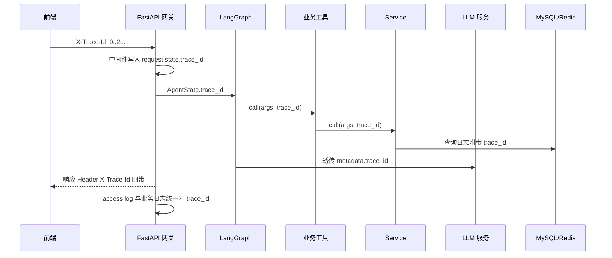

# API 设计文档

> 项目：面向电商售后场景的智能客服工单 Agent 系统
> 文档版本：v1.0
> 最近更新：2026-05-28
> 文档负责人：AI 应用架构组

## 修订记录

| 版本 | 日期       | 修订人 | 修订说明                                                                         |
| ---- | ---------- | ------ | -------------------------------------------------------------------------------- |
| v1.0 | 2026-05-28 | 架构组 | 初稿，定义 REST + SSE 接口与错误码规范。                                         |
| v1.1 | 2026-05-28 | 架构组 | 收敛到 MVP：每个接口标注 MVP 必需/后续版本；新增闭环 11 步与接口的映射；简化坐席管理。 |

## 目录

- [0. MVP 接口范围说明](#0-mvp-接口范围说明)
- [1. 设计规范](#1-设计规范)
- [2. 鉴权](#2-鉴权)
- [3. 接口分组](#3-接口分组)
- [4. 流式响应协议（SSE）](#4-流式响应协议sse)
- [5. 错误码](#5-错误码)
- [6. 接口示例](#6-接口示例)
- [7. trace_id 全链路设计](#7-trace_id-全链路设计)
- [8. 限流与幂等](#8-限流与幂等)
- [9. 与 Agent Tool 的对应关系](#9-与-agent-tool-的对应关系)
- [10. MVP 闭环 11 步与接口映射](#10-mvp-闭环-11-步与接口映射)

---

## 0. MVP 接口范围说明

> §3 接口分组中的每条接口都已用标签标注：
>
> - **[MVP]**：MVP 闭环必须实现，对应 [mvp-plan.md §2](mvp-plan.md#2-mvp-闭环验收脚本必做) 的某一步。
> - **[V1.1+]**：已设计、推迟实现，本期不写代码，文档保留以便后续演进。
>
> 凡未明确标注的接口，统一视为 **[MVP]**。具体推迟版本号见 [mvp-plan.md §3](mvp-plan.md#3-推迟到后续版本的能力清单明确不做)。

---

## 1. 设计规范

### 1.1 风格

- 风格：REST + 资源化路径（核心写操作偏 RPC 风格的动作如 `:claim` / `:close`）。
- 版本前缀：`/api/v1`。
- 数据格式：请求 / 响应均为 `application/json; charset=utf-8`，流式响应为 `text/event-stream`。
- 命名规范：
  - URL 单词用 `kebab-case`（如 `knowledge-docs`）。
  - JSON 字段使用 `snake_case`。
  - 资源 ID 使用业务编号（如 `order_no`、`ticket_no`），不直接暴露自增主键。
- 时间格式：ISO 8601，统一使用 UTC（如 `2026-05-28T13:54:00Z`）。

### 1.2 统一响应结构

成功：

```json
{
  "code": 0,
  "msg": "ok",
  "trace_id": "9a2c2f0a-...-1d3e",
  "data": { "...业务数据..." }
}
```

失败：

```json
{
  "code": 40001,
  "msg": "参数缺失：order_no",
  "trace_id": "9a2c2f0a-...-1d3e",
  "data": null,
  "errors": [
    { "field": "order_no", "reason": "required" }
  ]
}
```

### 1.3 列表分页

- 入参：`page`（从 1 开始，默认 1）+ `page_size`（默认 20，上限 100）。
- 返回：

```json
{
  "code": 0,
  "msg": "ok",
  "trace_id": "...",
  "data": {
    "items": [ ... ],
    "page": 1,
    "page_size": 20,
    "total": 137
  }
}
```

### 1.4 路径前缀按角色拆分

| 前缀                  | 适用角色   | 说明                                       |
| --------------------- | ---------- | ------------------------------------------ |
| `/api/v1/customer/*`  | C 端买家    | 会话、自助查询、反馈。                     |
| `/api/v1/agent/*`     | 人工坐席   | 工单领取、坐席工作台、消息。               |
| `/api/v1/admin/*`     | 管理端     | 知识库、审计、监控、配置。                 |
| `/api/v1/internal/*`  | 系统内部   | 仅供 Agent / Worker 调用，必须签名。       |

## 2. 鉴权

### 2.1 JWT

- 三套角色：`buyer` / `agent` / `admin`。
- Header：`Authorization: Bearer <jwt>`。
- Payload 必含字段：`sub`（用户/坐席 ID）、`role`、`tenant_id`、`exp`、`iat`、`jti`。
- 过期策略：buyer 24h / agent 8h / admin 2h；提供 `/api/v1/auth/refresh` 续期。

### 2.2 角色与权限

| 角色  | 可访问前缀                                     | 关键写操作                                   |
| ----- | ---------------------------------------------- | -------------------------------------------- |
| buyer | `/api/v1/customer/*`                           | 创建会话、发送消息、提交反馈、查看本人工单。 |
| agent | `/api/v1/agent/*` + 只读 `/api/v1/customer/*` | 领取工单、回复消息、关闭工单。               |
| admin | 全部                                           | 知识库管理、审计、配置变更。                 |

### 2.3 SSE 鉴权

- SSE 连接走 `EventSource` 协议，不支持自定义 Header。
- 鉴权方式：`?access_token=<jwt>` 查询参数，网关校验后立即剥离不入日志。

## 3. 接口分组

下文每个接口给出方法 + 路径 + 简介；Request / Response JSON 详例见 [§6](#6-接口示例)。

### 3.1 会话与对话（buyer）

| 方法 | 路径                                                       | 范围 | 说明                                      |
| ---- | ---------------------------------------------------------- | ---- | ----------------------------------------- |
| POST | `/api/v1/customer/sessions`                                | MVP  | 创建新会话。                              |
| GET  | `/api/v1/customer/sessions`                                | MVP  | 当前用户的活跃会话列表。                  |
| GET  | `/api/v1/customer/sessions/{session_no}`                   | MVP  | 会话详情（含状态、是否人工接管）。        |
| POST | `/api/v1/customer/sessions/{session_no}/messages`          | MVP  | 发送消息并以 SSE 接收回复。               |
| GET  | `/api/v1/customer/sessions/{session_no}/messages`          | MVP  | 历史消息（分页）。                        |
| POST | `/api/v1/customer/sessions/{session_no}:close`             | MVP  | 用户主动结束会话。                        |

### 3.2 订单 / 物流 / 退款查询（buyer，同时供 Agent Tool 通过 internal 接口调用）

| 方法 | 路径                                                       | 范围 | 说明                                      |
| ---- | ---------------------------------------------------------- | ---- | ----------------------------------------- |
| GET  | `/api/v1/customer/orders`                                  | MVP  | 当前用户订单列表（支持时间范围）。        |
| GET  | `/api/v1/customer/orders/{order_no}`                       | MVP  | 单笔订单详情（含商品）。                  |
| GET  | `/api/v1/customer/orders/{order_no}/logistics`             | MVP  | 该订单物流轨迹。                          |
| GET  | `/api/v1/customer/refunds`                                 | MVP  | 当前用户退款单列表。                      |
| GET  | `/api/v1/customer/refunds/{refund_no}`                     | MVP  | 单笔退款单详情。                          |
| POST | `/api/v1/customer/refunds`                                 | MVP  | 用户侧主动创建退款单（也可由 Agent 工单流程触发）。 |

### 3.3 工单（buyer / agent）

| 方法  | 路径                                                          | 角色  | 范围  | 说明                                        |
| ----- | ------------------------------------------------------------- | ----- | ----- | ------------------------------------------- |
| GET   | `/api/v1/customer/tickets`                                    | buyer | MVP   | 用户本人工单列表（支持状态过滤）。          |
| GET   | `/api/v1/customer/tickets/{ticket_no}`                        | buyer | MVP   | 工单详情（含事件流）。                      |
| POST  | `/api/v1/customer/tickets`                                    | buyer | MVP   | 用户主动创建工单。                          |
| GET   | `/api/v1/agent/tickets`                                       | agent | MVP   | 工单待接队列 + 我处理中的工单。             |
| POST  | `/api/v1/agent/tickets/{ticket_no}:claim`                     | agent | MVP   | 坐席领取工单。                              |
| POST  | `/api/v1/agent/tickets/{ticket_no}:transfer`                  | agent | V1.1+ | 坐席转派工单。                              |
| POST  | `/api/v1/agent/tickets/{ticket_no}:reply`                     | agent | MVP   | 坐席在工单内回复用户。                      |
| POST  | `/api/v1/agent/tickets/{ticket_no}:close`                     | agent | MVP   | 关闭工单（必须填 `solution` / `root_cause` / `can_distill`，闭环步骤 8）。 |
| POST  | `/api/v1/agent/tickets/{ticket_no}:escalate`                  | agent | V1.1+ | 升级工单（priority 自动 +1）。              |
| GET   | `/api/v1/agent/tickets/{ticket_no}/events`                    | agent | MVP   | 工单事件流。                                |

### 3.4 人工坐席（agent）

| 方法 | 路径                                                       | 范围  | 说明                                      |
| ---- | ---------------------------------------------------------- | ----- | ----------------------------------------- |
| POST | `/api/v1/auth/agent/login`                                 | MVP   | 坐席登录。                                |
| POST | `/api/v1/agent/status`                                     | MVP   | 设置在线/忙碌/离开。                      |
| GET  | `/api/v1/agent/sessions/pending`                           | MVP   | 待接会话队列（闭环步骤 6 推送目标）。     |
| POST | `/api/v1/agent/sessions/{session_no}:take`                 | MVP   | 接管会话（闭环步骤 7）。                   |
| POST | `/api/v1/agent/sessions/{session_no}/messages`             | MVP   | 坐席发送消息（与 Agent 消息接口同型，role=agent）。 |
| POST | `/api/v1/agent/sessions/{session_no}:release`              | MVP   | 坐席释放会话（结束或转回 Agent 辅助）。   |
| GET  | `/api/v1/agent/sse`                                        | MVP   | 坐席端 SSE 连接（接新会话提醒/新消息）。  |

### 3.5 知识库（admin / 知识运营）

| 方法 | 路径                                                       | 范围  | 说明                                      |
| ---- | ---------------------------------------------------------- | ----- | ----------------------------------------- |
| POST | `/api/v1/admin/knowledge/docs`                             | MVP   | 上传知识文档（multipart 或对象存储引用）。 |
| GET  | `/api/v1/admin/knowledge/docs`                             | MVP   | 知识文档列表（支持类型/状态过滤）。       |
| GET  | `/api/v1/admin/knowledge/docs/{doc_no}`                    | MVP   | 文档元数据详情。                          |
| GET  | `/api/v1/admin/knowledge/docs/{doc_no}/chunks`             | MVP   | 文档切片预览。                            |
| POST | `/api/v1/admin/knowledge/docs/{doc_no}:publish`            | MVP   | 发布（写 Milvus，闭环步骤 11）。           |
| POST | `/api/v1/admin/knowledge/docs/{doc_no}:offline`            | MVP   | 下线（从 Milvus 移除）。                  |
| POST | `/api/v1/admin/knowledge/docs/{doc_no}:rebuild`            | V1.1+ | 重建向量（模型升级时使用）。               |
| GET  | `/api/v1/admin/knowledge/debug`                            | MVP   | 检索 Debug：给定 query 返回三路召回 + Rerank 中间结果。 |
| GET  | `/api/v1/admin/knowledge/candidates`                       | MVP   | 知识沉淀候选列表（闭环步骤 9 产物）。      |
| POST | `/api/v1/admin/knowledge/candidates/{id}:approve`          | MVP   | 审核通过候选 → 自动入库（闭环步骤 10）。   |
| POST | `/api/v1/admin/knowledge/candidates/{id}:reject`           | MVP   | 驳回候选。                                |

### 3.6 满意度反馈（buyer）

| 方法 | 路径                                                       | 范围 | 说明                                      |
| ---- | ---------------------------------------------------------- | ---- | ----------------------------------------- |
| POST | `/api/v1/customer/feedbacks`                               | MVP  | 提交满意度评分。                          |
| GET  | `/api/v1/customer/feedbacks/{session_no}`                  | MVP  | 查询本会话已提交的反馈。                  |

### 3.7 管理端：审计与 Agent 调用链（admin）

| 方法 | 路径                                                       | 范围  | 说明                                      |
| ---- | ---------------------------------------------------------- | ----- | ----------------------------------------- |
| GET  | `/api/v1/admin/traces/{trace_id}`                          | MVP   | 按 trace_id 查询一次会话的完整 Agent 调用链。 |
| GET  | `/api/v1/admin/metrics/dashboard`                          | MVP   | **简易仪表盘**：仅返回 5 个固定指标（自动化率 / 转人工率 / CSAT / SLA 达成率 / 7 日新增工单数），不做下钻、不带时间序列。 |
| GET  | `/api/v1/admin/sessions`                                   | V1.1+ | 全量会话审计（支持时间、用户、坐席筛选）。MVP 阶段通过 `/admin/traces/{trace_id}` 单条反查替代。 |
| GET  | `/api/v1/admin/agents`                                     | MVP   | 坐席列表与当前状态（只读，便于 Demo 时切换坐席）。 |
| POST | `/api/v1/admin/agents`                                     | V1.1+ | 创建坐席账号。MVP 阶段坐席通过 `scripts/seed_mock.py` 植入。 |
| PATCH| `/api/v1/admin/agents/{agent_no}`                          | V1.1+ | 更新坐席信息或角色。同上，MVP 不在前端实现。 |

## 4. 流式响应协议（SSE）

### 4.1 适用接口

- `POST /api/v1/customer/sessions/{session_no}/messages`
- `GET /api/v1/agent/sse`

### 4.2 通用头与心跳

- 响应头：`Content-Type: text/event-stream; charset=utf-8`、`Cache-Control: no-cache`、`X-Accel-Buffering: no`。
- 心跳：每 15 秒发送一条 `event: ping\ndata: {"t": <ts>}\n\n`，前端忽略。
- 每个事件块结尾必须 `\n\n`。

### 4.3 事件类型（用户对话）

| `event` 字段        | `data` 字段（JSON）                                                                                       | 说明                                      |
| ------------------- | --------------------------------------------------------------------------------------------------------- | ----------------------------------------- |
| `meta`              | `{ "trace_id": "...", "session_no": "...", "intent": "policy_qa" }`                                       | 本轮元数据，首个事件。                    |
| `token`             | `{ "delta": "你好" }`                                                                                     | 回答 token 增量。                         |
| `tool_call`         | `{ "name": "query_order", "args": { "order_no": "OD..." } }`                                              | Agent 正在调用工具，前端可显示"查询中..."。 |
| `tool_result`       | `{ "name": "query_order", "ok": true, "summary": "订单状态=delivered" }`                                  | 工具完成。                                |
| `citation`          | `{ "doc_title": "售后服务条款", "chunk_no": 3, "url": "..." }`                                            | 引用片段。                                |
| `ticket`            | `{ "ticket_no": "T20260528-001", "status": "pending", "url": "..." }`                                     | 本轮产生的工单。                          |
| `handoff`           | `{ "reason": "complaint", "queue_size": 3, "eta_sec": 180 }`                                              | 已转人工。                                |
| `feedback_request`  | `{ "session_no": "...", "ticket_no": "..." }`                                                             | 请求用户填写满意度。                      |
| `done`              | `{ "answer_len": 213, "tokens": { "in": 480, "out": 215 }, "elapsed_ms": 2310 }`                          | 本轮结束。                                |
| `error`             | `{ "code": 50001, "msg": "..." }`                                                                         | 异常，前端展示并允许重试。                |

### 4.4 事件类型（坐席端 `/agent/sse`）

| `event` 字段           | `data` 字段                                                                          | 说明                                      |
| ---------------------- | ------------------------------------------------------------------------------------ | ----------------------------------------- |
| `pending_session`      | `{ "session_no": "...", "user_no": "...", "summary": "...", "priority": "high" }`    | 新待接会话提醒。                          |
| `user_message`         | `{ "session_no": "...", "content": "...", "ts": "..." }`                             | 已接管会话内用户的新消息。                 |
| `agent_assigned`       | `{ "session_no": "...", "ticket_no": "..." }`                                        | 系统强分派会话给当前坐席。                 |
| `ticket_updated`       | `{ "ticket_no": "...", "to_status": "resolved" }`                                    | 工单状态变更。                            |
| `ping`                 | `{ "t": 1716913456 }`                                                                | 心跳。                                    |

## 5. 错误码

错误码采用 5 位整数：前 2 位表示模块，后 3 位表示具体错误。

| 范围           | 模块                       |
| -------------- | -------------------------- |
| `10xxx`        | 鉴权                       |
| `20xxx`        | 会话与消息                 |
| `30xxx`        | 工单                       |
| `40xxx`        | 参数 / 通用错误            |
| `50xxx`        | Agent / 工具 / RAG 错误    |
| `60xxx`        | 知识库                     |
| `90xxx`        | 系统级（数据库、缓存等）   |

### 5.1 常用错误码

| code  | HTTP | 说明                               |
| ----- | ---- | ---------------------------------- |
| 0     | 200  | 成功                               |
| 10001 | 401  | 未登录或 token 失效                |
| 10002 | 403  | 无权限                             |
| 10003 | 429  | 限流（按用户或按工具）             |
| 20001 | 404  | 会话不存在                         |
| 20002 | 409  | 会话已结束或已交接                 |
| 20003 | 400  | 会话不属于当前用户                 |
| 30001 | 404  | 工单不存在                         |
| 30002 | 409  | 工单状态不允许此操作               |
| 30003 | 400  | 工单关闭缺少 solution 字段         |
| 40001 | 400  | 参数缺失                           |
| 40002 | 400  | 参数格式错误                       |
| 40003 | 413  | 内容过长                           |
| 50001 | 500  | Agent 节点异常                     |
| 50002 | 504  | 工具调用超时                       |
| 50003 | 502  | LLM 服务不可用                     |
| 50004 | 502  | Milvus 不可用，已降级到 BM25       |
| 50005 | 422  | 命中输入审查（高敏内容）           |
| 60001 | 400  | 知识文档解析失败                   |
| 60002 | 409  | 知识文档状态不允许此操作           |
| 60003 | 400  | 候选已审核                         |
| 90001 | 500  | 数据库异常                         |
| 90002 | 503  | 服务不可用                         |

## 6. 接口示例

### 6.1 创建会话

`POST /api/v1/customer/sessions`

请求：

```json
{
  "channel": "web",
  "entry_intent_hint": "refund_query"
}
```

响应：

```json
{
  "code": 0,
  "msg": "ok",
  "trace_id": "9a2c2f0a-...-1d3e",
  "data": {
    "session_no": "S20260528-000123",
    "status": "active",
    "started_at": "2026-05-28T13:54:00Z"
  }
}
```

### 6.2 发送消息（SSE）

`POST /api/v1/customer/sessions/S20260528-000123/messages`

请求：

```json
{ "content": "订单 OD20260525001 我想退款。" }
```

响应（SSE，节选）：

```
event: meta
data: {"trace_id":"9a2c2f0a-...-1d3e","session_no":"S20260528-000123","intent":"refund_apply"}

event: tool_call
data: {"name":"query_order","args":{"order_no":"OD20260525001"}}

event: tool_result
data: {"name":"query_order","ok":true,"summary":"status=delivered, days_since=3, amount=199"}

event: tool_call
data: {"name":"create_refund_ticket","args":{"order_no":"OD20260525001","amount":199}}

event: ticket
data: {"ticket_no":"T20260528-001","status":"pending","url":"/customer/tickets/T20260528-001"}

event: token
data: {"delta":"已为您发起退款"}

event: token
data: {"delta":"，预计 1-3 个工作日"}

event: citation
data: {"doc_title":"售后服务条款","chunk_no":3,"url":"/admin/knowledge/docs/D-0001#chunk-3"}

event: done
data: {"answer_len":92,"tokens":{"in":480,"out":215},"elapsed_ms":2310}
```

### 6.3 查询订单（Agent 工具底层 / 用户自助查询共用）

`GET /api/v1/customer/orders/OD20260525001`

响应：

```json
{
  "code": 0,
  "msg": "ok",
  "trace_id": "9a2c2f0a-...-1d3e",
  "data": {
    "order_no": "OD20260525001",
    "status": "delivered",
    "total_amount": 199.0,
    "paid_at": "2026-05-25T10:11:00Z",
    "shipped_at": "2026-05-25T18:00:00Z",
    "delivered_at": "2026-05-26T15:30:00Z",
    "items": [
      { "sku_id": "SKU-008", "sku_name": "运动鞋 42 码", "quantity": 1, "unit_price": 199.0 }
    ]
  }
}
```

### 6.4 创建工单（buyer）

`POST /api/v1/customer/tickets`

请求：

```json
{
  "ticket_type": "logistics",
  "priority": "medium",
  "order_no": "OD20260525001",
  "summary": "物流停滞 3 天未更新",
  "reason": "user_request"
}
```

响应：

```json
{
  "code": 0,
  "msg": "ok",
  "trace_id": "9a2c2f0a-...-1d3e",
  "data": {
    "ticket_no": "T20260528-007",
    "status": "pending",
    "priority": "medium",
    "sla_due_at": "2026-05-29T13:54:00Z"
  }
}
```

### 6.5 坐席领取工单

`POST /api/v1/agent/tickets/T20260528-007:claim`

请求：

```json
{}
```

响应：

```json
{
  "code": 0,
  "msg": "ok",
  "trace_id": "...",
  "data": {
    "ticket_no": "T20260528-007",
    "status": "processing",
    "assignee_no": "A-002"
  }
}
```

错误示例（状态不允许）：

```json
{
  "code": 30002,
  "msg": "工单当前状态(closed)不允许 claim",
  "trace_id": "...",
  "data": null
}
```

### 6.6 关闭工单

`POST /api/v1/agent/tickets/T20260528-007:close`

请求：

```json
{
  "solution": "已联系承运商加急，48 小时内派送，已通知用户。",
  "root_cause": "logistics_carrier_delay",
  "can_distill": true
}
```

响应：

```json
{
  "code": 0,
  "msg": "ok",
  "trace_id": "...",
  "data": {
    "ticket_no": "T20260528-007",
    "status": "closed",
    "candidate_id": 42
  }
}
```

### 6.7 知识检索 Debug

`GET /api/v1/admin/knowledge/debug?query=7%E5%A4%A9%E6%97%A0%E7%90%86%E7%94%B1%E8%83%BD%E9%80%80%E8%BF%90%E8%B4%B9%E5%90%97`

响应：

```json
{
  "code": 0,
  "msg": "ok",
  "trace_id": "...",
  "data": {
    "rewritten_queries": [
      "7 天无理由能退运费吗",
      "无理由退货 运费 谁出",
      "运费险 7 天无理由"
    ],
    "bm25_recall": [
      { "doc_title": "售后服务条款", "chunk_no": 3, "score": 4.21 },
      { "doc_title": "运费险说明", "chunk_no": 1, "score": 3.87 }
    ],
    "vector_recall": [
      { "doc_title": "售后服务条款", "chunk_no": 3, "score": 0.81 },
      { "doc_title": "FAQ-退款", "chunk_no": 12, "score": 0.74 }
    ],
    "rerank_topk": [
      { "doc_title": "售后服务条款", "chunk_no": 3, "score": 0.93 },
      { "doc_title": "运费险说明", "chunk_no": 1, "score": 0.88 }
    ]
  }
}
```

### 6.8 trace 反查

`GET /api/v1/admin/traces/9a2c2f0a-...-1d3e`

响应（节选）：

```json
{
  "code": 0,
  "msg": "ok",
  "trace_id": "9a2c2f0a-...-1d3e",
  "data": {
    "session_no": "S20260528-000123",
    "nodes": [
      { "name": "input_guard",       "duration_ms": 12,  "ok": true },
      { "name": "intent_classifier", "duration_ms": 145, "ok": true, "intent": "refund_apply", "score": 0.91 },
      { "name": "slot_filler",       "duration_ms": 132, "ok": true, "slots": { "order_no": "OD20260525001" } },
      { "name": "retriever",         "duration_ms": 320, "ok": true, "top_score": 0.93 },
      { "name": "tool_executor",     "duration_ms": 410, "ok": true, "tools": ["query_order","create_refund_ticket"] },
      { "name": "policy_judge",      "duration_ms":  85, "ok": true, "need_human": false },
      { "name": "answer_composer",   "duration_ms": 1208,"ok": true, "tokens_in": 480, "tokens_out": 215 }
    ],
    "ticket_no": "T20260528-001",
    "tokens_total": { "in": 480, "out": 215 }
  }
}
```

## 7. trace_id 全链路设计



要点：

- 前端首次会话生成 UUID v4，存 `sessionStorage` 或会话 cookie，每次请求附在 `X-Trace-Id` 头。
- 网关中间件：缺失则生成；填回响应头。
- 后端日志通过 contextvar / loguru extra 注入 `trace_id`，避免手工传参遗漏。
- 写入 `sessions / messages / tickets / feedbacks` 表的 `trace_id` 字段，便于多表 JOIN 反查。

## 8. 限流与幂等

### 8.1 限流

| 维度                        | 默认值                | 实现                                |
| --------------------------- | --------------------- | ----------------------------------- |
| 每用户每分钟消息数          | 30                    | Redis 滑动窗口（`ratelimit:user:*`）。 |
| 每用户每分钟创建工单数      | 5                     | Redis（`ratelimit:ticket:*`）。      |
| 高成本工具（LLM/RAG）总 QPS | 全局令牌桶            | Redis 令牌桶。                       |
| 知识文档上传                | 单租户 10 次/小时     | Redis。                              |

返回限流：HTTP 429 + `code = 10003` + `Retry-After` 头。

### 8.2 幂等

- 写接口（创建工单、提交反馈、坐席关闭工单）必须支持 `Idempotency-Key` 头：服务端用 Redis 缓存 5 分钟，重复请求返回上一次结果。
- 工具调用幂等：同 `tool_name + args_hash` 在 5 分钟内复用结果（详见 [database-design.md §6.4](database-design.md#64-限流与幂等)）。

## 9. 与 Agent Tool 的对应关系

下表把 [agent-workflow.md §6](agent-workflow.md#6-工具清单tool-calling-schema) 中的工具映射到本文档的接口。Agent 工具实际通过 internal RPC 或直接 service 调用完成，不一定经过公网 HTTP，但语义与下列 API 保持一致。

| Tool                    | 对应接口（语义）                                                  | 备注                                  |
| ----------------------- | ----------------------------------------------------------------- | ------------------------------------- |
| `query_order`           | `GET /api/v1/customer/orders` / `GET /api/v1/customer/orders/{order_no}` | 工具直接调用 service，鉴权用 session 上下文。 |
| `query_logistics`       | `GET /api/v1/customer/orders/{order_no}/logistics`                | -                                     |
| `query_refund`          | `GET /api/v1/customer/refunds` / `GET /api/v1/customer/refunds/{refund_no}` | -                                     |
| `query_ticket`          | `GET /api/v1/customer/tickets`                                    | -                                     |
| `create_ticket`         | `POST /api/v1/customer/tickets`                                   | Agent 调用时 `source=agent`。         |
| `create_refund_ticket`  | `POST /api/v1/customer/refunds` + `POST /api/v1/customer/tickets` | 内部组合调用，事务保证。              |
| `transfer_to_human`     | 内部 `POST /api/v1/internal/sessions/{session_no}:handoff`        | 写 Redis 队列 + SSE 推送。           |
| `knowledge_search`      | 内部 `GET /api/v1/internal/knowledge/search`                      | 与 `/admin/knowledge/debug` 共享内核。 |

## 10. MVP 闭环 11 步与接口映射

> 本节用来确保 MVP 实现时接口与闭环一一对齐，详见 [mvp-plan.md §2](mvp-plan.md#2-mvp-闭环验收脚本必做)。

| 步骤 | 名称                | 触发接口（外部）                                                                                  | 内部副作用                                                            |
| ---- | ------------------- | ------------------------------------------------------------------------------------------------- | --------------------------------------------------------------------- |
| 1    | 用户发起咨询        | `POST /api/v1/customer/sessions` → `POST /api/v1/customer/sessions/{session_no}/messages`         | 写 `sessions` / `messages`；建立 SSE 连接。                            |
| 2    | Agent 意图识别      | （同上 SSE 内部，由 `intent_classifier` 节点完成）                                                  | `messages.intent` 写入；trace 记录节点耗时。                          |
| 3    | RAG / 工具查询      | 内部：`/api/v1/internal/knowledge/search` 或工具对应的查询接口                                       | SSE 推 `tool_call` / `tool_result` / `citation` 事件。                |
| 4    | 风险判定            | （同上 SSE 内部，由 `policy_judge` 节点完成）                                                       | 写 `sessions.need_human` / `sessions.handoff_reason`。                |
| 5    | 自动回答（分支 A）   | （同上 SSE 内部，由 `answer_composer` 节点完成）                                                    | 写 `messages`（role=assistant）+ citation；SSE 推 `done`。            |
| 6    | 创建工单 + 转人工（分支 B） | 内部：工具 `create_ticket` + `transfer_to_human`；外部观察：`GET /api/v1/agent/tickets`              | 写 `tickets` / `ticket_events`；SSE 推 `ticket` / `handoff` 事件；Redis 推坐席队列。 |
| 7    | 坐席接管处理        | `POST /api/v1/agent/sessions/{session_no}:take` + `POST /api/v1/agent/tickets/{ticket_no}:claim` + `POST /api/v1/agent/sessions/{session_no}/messages` | 工单 `pending → processing`；坐席消息 `role=agent` 入 `messages`。     |
| 8    | 坐席关闭工单        | `POST /api/v1/agent/tickets/{ticket_no}:close`                                                    | 工单 `processing → closed`；强制 `solution` / `root_cause` / `can_distill`。 |
| 9    | 生成知识候选        | （`:close` 时若 `can_distill=true` 由后端自动触发）                                                  | 写 `knowledge_docs`（`status=pending_review`, `source=distill`, `source_ticket_id`）。 |
| 10   | 管理端审核候选      | `GET /api/v1/admin/knowledge/candidates` + `POST /api/v1/admin/knowledge/candidates/{id}:approve` | 切片入库、调 Embedding、写 Milvus；`knowledge_chunks.milvus_pk` 回填。 |
| 11   | 同类问题被命中      | 复现 `POST /api/v1/customer/sessions/{session_no}/messages`                                       | RAG 召回结果含步骤 10 新增的 `doc_id`；trace 可证明命中。              |
