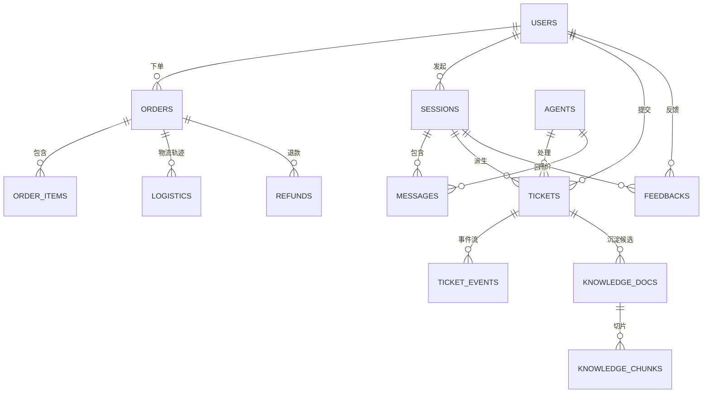
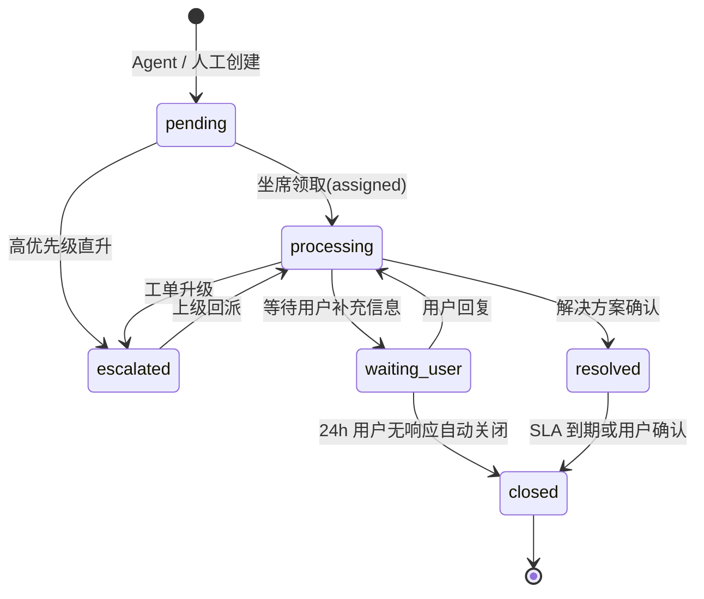

# 数据库设计文档

> 项目：面向电商售后场景的智能客服工单 Agent 系统
> 文档版本：v1.0
> 最近更新：2026-05-28
> 文档负责人：AI 应用架构组

## 修订记录

| 版本 | 日期       | 修订人 | 修订说明                                                           |
| ---- | ---------- | ------ | ------------------------------------------------------------------ |
| v1.0 | 2026-05-28 | 架构组 | 初稿，13 张 MySQL 表 + Redis Key + Milvus 集合。                     |
| v1.1 | 2026-05-28 | 架构组 | 收敛到 MVP：明确 `tenant_id` 仅为预留字段，不参与查询过滤；新增 MVP 关键字段索引。 |

## 目录

- [1. 数据存储总览](#1-数据存储总览)
- [2. ER 图](#2-er-图)
- [3. MySQL 表结构](#3-mysql-表结构)
- [4. 索引设计与查询场景](#4-索引设计与查询场景)
- [5. 工单状态机](#5-工单状态机)
- [6. Redis Key 设计规范](#6-redis-key-设计规范)
- [7. Milvus 集合设计](#7-milvus-集合设计)
- [8. 数据迁移与初始化](#8-数据迁移与初始化)
- [9. 数据安全与脱敏](#9-数据安全与脱敏)

---

## 1. 数据存储总览

| 存储                | 角色                                                                                | 关键数据                                                |
| ------------------- | ----------------------------------------------------------------------------------- | ------------------------------------------------------- |
| **MySQL 8.0**       | 业务系统主库，强一致性场景。                                                        | 用户、订单、物流、退款、会话、消息、工单、知识库元数据。 |
| **Redis 7**         | 缓存与运行态状态，弱一致、低延时。                                                  | 会话上下文、限流、幂等、坐席队列与在线状态、SSE 通道。   |
| **Milvus 2.4**      | 向量检索引擎，存储知识切片向量。                                                    | 切片向量、metadata（doc_id / chunk_no / chunk_type）。   |
| **对象存储 (MinIO)** | 知识文档原文与脱敏报告等非结构化文件。                                              | PDF / DOCX / 解析后 JSON。                              |

字符集与排序：MySQL 统一使用 `utf8mb4 / utf8mb4_0900_ai_ci`；所有时间字段使用 `DATETIME(3)` 并默认 UTC 存储，应用层做时区转换。

## 2. ER 图



## 3. MySQL 表结构

> 所有表均包含通用字段：`id BIGINT UNSIGNED PRIMARY KEY AUTO_INCREMENT`、`tenant_id VARCHAR(32) NOT NULL DEFAULT 'default'`、`created_at DATETIME(3) DEFAULT CURRENT_TIMESTAMP(3)`、`updated_at DATETIME(3) ON UPDATE CURRENT_TIMESTAMP(3)`、`deleted_at DATETIME(3) NULL`。下文 SQL 为简化示例，仅展示与业务强相关的字段。
>
> **关于 `tenant_id`（重要）**：MVP 阶段仅是字段保留，**不参与任何查询过滤、不出现在索引前缀、业务层不感知**。所有数据默认归属租户 `default`。多租户能力推迟至 V2.0（见 [mvp-plan.md §3](mvp-plan.md#3-推迟到后续版本的能力清单明确不做)）。下文虽然在唯一键中保留 `(tenant_id, xxx_no)` 的写法，目的是为后续平滑迁移；MVP 中等价于 `(xxx_no)`。
>
> **闭环关键字段速查**（与 [mvp-plan.md §2.2](mvp-plan.md#22-步骤明细与验收点) 一一对应）：
>
> | 闭环步骤 | 关键字段                                                          |
> | -------- | ----------------------------------------------------------------- |
> | 1-2      | `sessions.trace_id` / `messages.intent` / `messages.trace_id`     |
> | 3        | `messages.content_meta`（工具结果与引用结构化）                    |
> | 4        | `sessions.need_human` / `sessions.handoff_reason`                  |
> | 6        | `tickets.status='pending'` / `ticket_events.event_type='created'` |
> | 7-8      | `tickets.status` 状态机 / `tickets.solution` / `tickets.root_cause` / `tickets.can_distill` |
> | 9        | `knowledge_docs.status='pending_review'` / `knowledge_docs.source='distill'` / `knowledge_docs.source_ticket_id` |
> | 10-11    | `knowledge_docs.status='published'` / `knowledge_chunks.milvus_pk` 回填 |

### 3.1 `users` 用户

```sql
CREATE TABLE users (
  id           BIGINT UNSIGNED AUTO_INCREMENT PRIMARY KEY,
  tenant_id    VARCHAR(32)   NOT NULL DEFAULT 'default',
  user_no      VARCHAR(32)   NOT NULL COMMENT '业务用户编号',
  nickname     VARCHAR(64)   NOT NULL,
  phone_masked VARCHAR(32)   NOT NULL COMMENT '脱敏后手机号',
  level        TINYINT       NOT NULL DEFAULT 0 COMMENT '0普通 1银 2金 3VIP',
  status       TINYINT       NOT NULL DEFAULT 1 COMMENT '1正常 2冻结',
  created_at   DATETIME(3)   NOT NULL DEFAULT CURRENT_TIMESTAMP(3),
  updated_at   DATETIME(3)   NOT NULL DEFAULT CURRENT_TIMESTAMP(3) ON UPDATE CURRENT_TIMESTAMP(3),
  UNIQUE KEY uk_tenant_user_no (tenant_id, user_no),
  KEY idx_level_status (level, status)
) ENGINE=InnoDB COMMENT='用户表（含脱敏后手机号，原始号码不入库）';
```

### 3.2 `orders` 订单

```sql
CREATE TABLE orders (
  id          BIGINT UNSIGNED AUTO_INCREMENT PRIMARY KEY,
  tenant_id   VARCHAR(32)   NOT NULL DEFAULT 'default',
  order_no    VARCHAR(32)   NOT NULL COMMENT '订单号',
  user_id     BIGINT UNSIGNED NOT NULL,
  status      VARCHAR(24)   NOT NULL COMMENT 'created/paid/shipping/delivered/closed/refunded',
  total_amount DECIMAL(12,2) NOT NULL DEFAULT 0,
  paid_at     DATETIME(3)   NULL,
  shipped_at  DATETIME(3)   NULL,
  delivered_at DATETIME(3)  NULL,
  created_at  DATETIME(3)   NOT NULL DEFAULT CURRENT_TIMESTAMP(3),
  updated_at  DATETIME(3)   NOT NULL DEFAULT CURRENT_TIMESTAMP(3) ON UPDATE CURRENT_TIMESTAMP(3),
  UNIQUE KEY uk_tenant_order_no (tenant_id, order_no),
  KEY idx_user_created (user_id, created_at),
  KEY idx_status (status)
) ENGINE=InnoDB COMMENT='订单主表';
```

### 3.3 `order_items` 订单明细

```sql
CREATE TABLE order_items (
  id         BIGINT UNSIGNED AUTO_INCREMENT PRIMARY KEY,
  order_id   BIGINT UNSIGNED NOT NULL,
  sku_id     VARCHAR(32)   NOT NULL,
  sku_name   VARCHAR(128)  NOT NULL,
  quantity   INT           NOT NULL DEFAULT 1,
  unit_price DECIMAL(12,2) NOT NULL,
  created_at DATETIME(3)   NOT NULL DEFAULT CURRENT_TIMESTAMP(3),
  KEY idx_order_id (order_id),
  KEY idx_sku_id (sku_id)
) ENGINE=InnoDB COMMENT='订单商品明细';
```

### 3.4 `logistics` 物流轨迹

```sql
CREATE TABLE logistics (
  id           BIGINT UNSIGNED AUTO_INCREMENT PRIMARY KEY,
  order_id     BIGINT UNSIGNED NOT NULL,
  carrier      VARCHAR(32)   NOT NULL COMMENT '承运商代码',
  tracking_no  VARCHAR(64)   NOT NULL,
  node_code    VARCHAR(32)   NOT NULL COMMENT '揽收/运输中/派送中/已签收/异常',
  node_desc    VARCHAR(255)  NOT NULL,
  node_time    DATETIME(3)   NOT NULL,
  created_at   DATETIME(3)   NOT NULL DEFAULT CURRENT_TIMESTAMP(3),
  KEY idx_order_time (order_id, node_time),
  KEY idx_tracking (tracking_no)
) ENGINE=InnoDB COMMENT='物流轨迹明细，按事件追加';
```

### 3.5 `refunds` 退款单

```sql
CREATE TABLE refunds (
  id          BIGINT UNSIGNED AUTO_INCREMENT PRIMARY KEY,
  tenant_id   VARCHAR(32)   NOT NULL DEFAULT 'default',
  refund_no   VARCHAR(32)   NOT NULL,
  order_id    BIGINT UNSIGNED NOT NULL,
  user_id     BIGINT UNSIGNED NOT NULL,
  status      VARCHAR(24)   NOT NULL COMMENT 'applied/approved/rejected/refunding/refunded/canceled',
  amount      DECIMAL(12,2) NOT NULL,
  reason      VARCHAR(255)  NOT NULL,
  refund_type VARCHAR(16)   NOT NULL COMMENT 'refund_only/return_refund/exchange',
  applied_at  DATETIME(3)   NOT NULL,
  finished_at DATETIME(3)   NULL,
  created_at  DATETIME(3)   NOT NULL DEFAULT CURRENT_TIMESTAMP(3),
  updated_at  DATETIME(3)   NOT NULL DEFAULT CURRENT_TIMESTAMP(3) ON UPDATE CURRENT_TIMESTAMP(3),
  UNIQUE KEY uk_tenant_refund_no (tenant_id, refund_no),
  KEY idx_order_id (order_id),
  KEY idx_user_status (user_id, status)
) ENGINE=InnoDB COMMENT='退款单';
```

### 3.6 `sessions` 客服会话

```sql
CREATE TABLE sessions (
  id              BIGINT UNSIGNED AUTO_INCREMENT PRIMARY KEY,
  tenant_id       VARCHAR(32)   NOT NULL DEFAULT 'default',
  session_no      VARCHAR(32)   NOT NULL COMMENT '业务会话编号',
  user_id         BIGINT UNSIGNED NOT NULL,
  channel         VARCHAR(16)   NOT NULL DEFAULT 'web' COMMENT 'web/h5/app',
  status          VARCHAR(16)   NOT NULL DEFAULT 'active' COMMENT 'active/handoff/closed/timeout',
  agent_id        BIGINT UNSIGNED NULL COMMENT '当前接管的人工坐席',
  need_human      TINYINT       NOT NULL DEFAULT 0,
  handoff_reason  VARCHAR(32)   NULL,
  last_intent     VARCHAR(32)   NULL,
  trace_id        VARCHAR(64)   NOT NULL,
  started_at      DATETIME(3)   NOT NULL DEFAULT CURRENT_TIMESTAMP(3),
  ended_at        DATETIME(3)   NULL,
  UNIQUE KEY uk_tenant_session_no (tenant_id, session_no),
  KEY idx_user_started (user_id, started_at),
  KEY idx_status (status),
  KEY idx_agent_id (agent_id),
  KEY idx_trace (trace_id)
) ENGINE=InnoDB COMMENT='客服会话主表';
```

### 3.7 `messages` 消息记录

```sql
CREATE TABLE messages (
  id           BIGINT UNSIGNED AUTO_INCREMENT PRIMARY KEY,
  session_id   BIGINT UNSIGNED NOT NULL,
  role         VARCHAR(16)   NOT NULL COMMENT 'user/assistant/tool/system/agent',
  content      MEDIUMTEXT    NOT NULL,
  content_meta JSON          NULL COMMENT '工具结果/引用/事件等结构化信息',
  intent       VARCHAR(32)   NULL,
  trace_id     VARCHAR(64)   NOT NULL,
  token_in     INT           NOT NULL DEFAULT 0,
  token_out    INT           NOT NULL DEFAULT 0,
  duration_ms  INT           NOT NULL DEFAULT 0,
  created_at   DATETIME(3)   NOT NULL DEFAULT CURRENT_TIMESTAMP(3),
  KEY idx_session_created (session_id, created_at),
  KEY idx_trace (trace_id),
  FULLTEXT KEY ft_content (content) WITH PARSER ngram
) ENGINE=InnoDB COMMENT='对话消息（用户/Agent/工具/坐席）';
```

### 3.8 `tickets` 工单

```sql
CREATE TABLE tickets (
  id              BIGINT UNSIGNED AUTO_INCREMENT PRIMARY KEY,
  tenant_id       VARCHAR(32)   NOT NULL DEFAULT 'default',
  ticket_no       VARCHAR(32)   NOT NULL,
  user_id         BIGINT UNSIGNED NOT NULL,
  session_id      BIGINT UNSIGNED NULL,
  order_id        BIGINT UNSIGNED NULL,
  ticket_type     VARCHAR(24)   NOT NULL COMMENT 'refund/logistics/complaint/general/escalation',
  priority        VARCHAR(8)    NOT NULL COMMENT 'high/medium/low',
  status          VARCHAR(24)   NOT NULL DEFAULT 'pending' COMMENT 'pending/processing/waiting_user/resolved/closed/escalated',
  source          VARCHAR(16)   NOT NULL COMMENT 'agent/manual',
  reason          VARCHAR(32)   NULL COMMENT 'complaint/low_confidence/tool_failure/user_request/policy_violation',
  summary         VARCHAR(500)  NOT NULL COMMENT 'Agent 生成的上下文摘要',
  solution        VARCHAR(1000) NULL COMMENT '关闭时填写的解决方案',
  root_cause      VARCHAR(64)   NULL,
  can_distill     TINYINT       NOT NULL DEFAULT 0 COMMENT '是否可沉淀知识',
  assignee_id     BIGINT UNSIGNED NULL,
  sla_due_at      DATETIME(3)   NULL,
  trace_id        VARCHAR(64)   NOT NULL,
  created_at      DATETIME(3)   NOT NULL DEFAULT CURRENT_TIMESTAMP(3),
  updated_at      DATETIME(3)   NOT NULL DEFAULT CURRENT_TIMESTAMP(3) ON UPDATE CURRENT_TIMESTAMP(3),
  closed_at       DATETIME(3)   NULL,
  UNIQUE KEY uk_tenant_ticket_no (tenant_id, ticket_no),
  KEY idx_user_status (user_id, status),
  KEY idx_assignee (assignee_id, status),
  KEY idx_priority_status (priority, status),
  KEY idx_sla_status (sla_due_at, status),
  KEY idx_session (session_id),
  KEY idx_trace (trace_id)
) ENGINE=InnoDB COMMENT='客服工单主表';
```

### 3.9 `ticket_events` 工单事件流

```sql
CREATE TABLE ticket_events (
  id          BIGINT UNSIGNED AUTO_INCREMENT PRIMARY KEY,
  ticket_id   BIGINT UNSIGNED NOT NULL,
  event_type  VARCHAR(32)   NOT NULL COMMENT 'created/assigned/status_changed/comment/escalated/closed',
  from_status VARCHAR(24)   NULL,
  to_status   VARCHAR(24)   NULL,
  actor_type  VARCHAR(16)   NOT NULL COMMENT 'agent/user/system',
  actor_id    BIGINT UNSIGNED NULL,
  payload     JSON          NULL,
  trace_id    VARCHAR(64)   NULL,
  created_at  DATETIME(3)   NOT NULL DEFAULT CURRENT_TIMESTAMP(3),
  KEY idx_ticket_time (ticket_id, created_at),
  KEY idx_event_type (event_type)
) ENGINE=InnoDB COMMENT='工单事件流（不可删除，仅追加）';
```

### 3.10 `agents` 人工坐席

```sql
CREATE TABLE agents (
  id            BIGINT UNSIGNED AUTO_INCREMENT PRIMARY KEY,
  tenant_id     VARCHAR(32)   NOT NULL DEFAULT 'default',
  agent_no      VARCHAR(32)   NOT NULL,
  nickname      VARCHAR(64)   NOT NULL,
  role          VARCHAR(16)   NOT NULL DEFAULT 'agent' COMMENT 'agent/supervisor/admin',
  status        VARCHAR(16)   NOT NULL DEFAULT 'offline' COMMENT 'online/busy/away/offline',
  max_concurrent INT          NOT NULL DEFAULT 5,
  password_hash VARCHAR(128)  NOT NULL,
  created_at    DATETIME(3)   NOT NULL DEFAULT CURRENT_TIMESTAMP(3),
  updated_at    DATETIME(3)   NOT NULL DEFAULT CURRENT_TIMESTAMP(3) ON UPDATE CURRENT_TIMESTAMP(3),
  UNIQUE KEY uk_tenant_agent_no (tenant_id, agent_no),
  KEY idx_status (status)
) ENGINE=InnoDB COMMENT='人工坐席账号表';
```

### 3.11 `knowledge_docs` 知识文档

```sql
CREATE TABLE knowledge_docs (
  id              BIGINT UNSIGNED AUTO_INCREMENT PRIMARY KEY,
  tenant_id       VARCHAR(32)   NOT NULL DEFAULT 'default',
  doc_no          VARCHAR(32)   NOT NULL,
  title           VARCHAR(255)  NOT NULL,
  doc_type        VARCHAR(24)   NOT NULL COMMENT 'policy/faq/product_script',
  source          VARCHAR(16)   NOT NULL DEFAULT 'upload' COMMENT 'upload/distill',
  status          VARCHAR(16)   NOT NULL DEFAULT 'draft' COMMENT 'draft/pending_review/published/offline',
  storage_path    VARCHAR(512)  NULL COMMENT '对象存储路径',
  effective_date  DATE          NULL,
  expire_date     DATE          NULL,
  version         INT           NOT NULL DEFAULT 1,
  source_ticket_id BIGINT UNSIGNED NULL COMMENT '从哪个工单沉淀',
  created_by      BIGINT UNSIGNED NULL,
  reviewed_by     BIGINT UNSIGNED NULL,
  created_at      DATETIME(3)   NOT NULL DEFAULT CURRENT_TIMESTAMP(3),
  updated_at      DATETIME(3)   NOT NULL DEFAULT CURRENT_TIMESTAMP(3) ON UPDATE CURRENT_TIMESTAMP(3),
  UNIQUE KEY uk_tenant_doc_no (tenant_id, doc_no),
  KEY idx_type_status (doc_type, status),
  KEY idx_effective (effective_date, expire_date)
) ENGINE=InnoDB COMMENT='知识文档元数据';
```

### 3.12 `knowledge_chunks` 切片元数据

```sql
CREATE TABLE knowledge_chunks (
  id            BIGINT UNSIGNED AUTO_INCREMENT PRIMARY KEY,
  doc_id        BIGINT UNSIGNED NOT NULL,
  chunk_no      INT           NOT NULL COMMENT '文档内顺序号',
  chunk_type    VARCHAR(16)   NOT NULL COMMENT 'policy/faq/product_script',
  content       MEDIUMTEXT    NOT NULL,
  content_hash  CHAR(64)      NOT NULL COMMENT 'sha256，用于去重',
  milvus_pk     BIGINT        NULL COMMENT 'Milvus 中的主键',
  embedding_model VARCHAR(64) NOT NULL,
  token_count   INT           NOT NULL DEFAULT 0,
  meta          JSON          NULL,
  created_at    DATETIME(3)   NOT NULL DEFAULT CURRENT_TIMESTAMP(3),
  UNIQUE KEY uk_doc_chunk (doc_id, chunk_no),
  KEY idx_hash (content_hash),
  KEY idx_milvus_pk (milvus_pk),
  FULLTEXT KEY ft_content (content) WITH PARSER ngram
) ENGINE=InnoDB COMMENT='知识切片元数据（与 Milvus 主键双向映射）';
```

### 3.13 `feedbacks` 满意度反馈

```sql
CREATE TABLE feedbacks (
  id           BIGINT UNSIGNED AUTO_INCREMENT PRIMARY KEY,
  tenant_id    VARCHAR(32)   NOT NULL DEFAULT 'default',
  session_id   BIGINT UNSIGNED NOT NULL,
  user_id      BIGINT UNSIGNED NOT NULL,
  ticket_id    BIGINT UNSIGNED NULL,
  rating       TINYINT       NOT NULL COMMENT '1-5 星',
  tags         JSON          NULL COMMENT '问题标签数组',
  comment      VARCHAR(500)  NULL,
  trace_id     VARCHAR(64)   NULL,
  created_at   DATETIME(3)   NOT NULL DEFAULT CURRENT_TIMESTAMP(3),
  UNIQUE KEY uk_session (session_id),
  KEY idx_rating (rating),
  KEY idx_ticket (ticket_id)
) ENGINE=InnoDB COMMENT='会话满意度反馈';
```

## 4. 索引设计与查询场景

| 查询场景                                       | 涉及表           | 命中索引                                |
| ---------------------------------------------- | ---------------- | --------------------------------------- |
| 按用户查近 30 天订单                           | `orders`         | `idx_user_created`                      |
| 按订单号查订单（Agent 工具）                   | `orders`         | `uk_tenant_order_no`                    |
| 查询订单最新物流轨迹                           | `logistics`      | `idx_order_time`                        |
| 按用户查在途退款                               | `refunds`        | `idx_user_status`                       |
| 查询用户当前活跃会话                           | `sessions`       | `idx_user_started`, `idx_status`        |
| 按 trace_id 全链路反查                         | `messages` 等多表 | `idx_trace`                             |
| 坐席待接工单列表（按优先级 + SLA）             | `tickets`        | `idx_priority_status`, `idx_sla_status` |
| SLA 即将超期工单监控（worker 扫描）            | `tickets`        | `idx_sla_status`                        |
| 按工单时间轴查事件                             | `ticket_events`  | `idx_ticket_time`                       |
| 按文档类型与状态筛选知识                       | `knowledge_docs` | `idx_type_status`                       |
| 知识切片关键词回查（debug / 反向定位 Milvus 命中片段） | `knowledge_chunks` | `idx_milvus_pk`, `ft_content`           |

## 5. 工单状态机

### 5.1 状态转移



### 5.2 状态字段约束

- `solution` 必须在 `resolved → closed` 时填写。
- `can_distill = 1` 必须配合非空 `solution`。
- 任何状态变更必须在 `ticket_events` 留痕（`from_status` / `to_status` / `actor_*`）。
- `escalated` 工单的 `priority` 必须自动提升一档。

## 6. Redis Key 设计规范

> 命名规范：`{tenant_id}:{module}:{purpose}:{id}`。**MVP 阶段 `tenant_id` 固定为 `default`**，业务层不解析也不替换。多租户能力推迟至 V2.0（见 [mvp-plan.md §3](mvp-plan.md#3-推迟到后续版本的能力清单明确不做)）。所有 key 必须设置 TTL（除非显式标注永久）。

### 6.1 会话上下文

| Key                                          | 类型 | TTL    | 说明                                         |
| -------------------------------------------- | ---- | ------ | -------------------------------------------- |
| `default:session:state:{session_id}`         | Hash | 2h     | 会话当前 AgentState 序列化（含意图、槽位）。 |
| `default:session:history:{session_id}`       | List | 2h     | 最近 N 轮消息缓存，加速 LLM 上下文拼装。     |
| `default:session:lock:{session_id}`          | String | 30s | 同一会话写互斥锁。                           |

### 6.2 坐席队列与在线状态

| Key                                          | 类型   | TTL  | 说明                                                 |
| -------------------------------------------- | ------ | ---- | ---------------------------------------------------- |
| `default:agent:queue:pending`                | ZSet   | 永久 | 全局待接队列，`score = priority_weight*10000 + created_ts`。 |
| `default:agent:online`                       | Set    | 永久 | 当前在线的坐席 ID 集合。                             |
| `default:agent:status:{agent_id}`            | Hash   | 永久 | 坐席状态、负载、最近心跳。                           |
| `default:agent:processing:{agent_id}`        | Set    | 永久 | 该坐席当前处理中的 session_id 集合。                  |

### 6.3 SSE 推送通道

| Key                                          | 类型   | TTL  | 说明                                             |
| -------------------------------------------- | ------ | ---- | ------------------------------------------------ |
| `default:sse:channel:user:{user_id}`         | Stream | 1h   | 用户端 SSE 事件流。                              |
| `default:sse:channel:agent:{agent_id}`       | Stream | 1h   | 坐席端 SSE 事件流（新会话提醒、用户新消息）。   |

### 6.4 限流与幂等

| Key                                                       | 类型   | TTL   | 说明                                            |
| --------------------------------------------------------- | ------ | ----- | ----------------------------------------------- |
| `default:ratelimit:user:{user_id}:msg`                    | String | 1m    | 每用户每分钟发送消息数限流。                   |
| `default:ratelimit:tool:{tool_name}:{user_id}`            | String | 1m    | 高成本工具按用户限流。                          |
| `default:idem:tool:{tool_name}:{hash(args)}`              | String | 5m    | 工具调用幂等，5 分钟内同参数直接复用结果。      |
| `default:idem:ticket:create:{session_id}:{ticket_type}`   | String | 30m   | 防止同一会话短时间内重复创建相同类型工单。      |

### 6.5 检索缓存

| Key                                                  | 类型 | TTL   | 说明                                       |
| ---------------------------------------------------- | ---- | ----- | ------------------------------------------ |
| `default:rag:cache:{tenant_id}:{query_hash}`         | String | 10m | 同 query 短时间内缓存检索 Top-K（含引用）。 |

## 7. Milvus 集合设计

### 7.1 集合 `knowledge_chunk_v1`

| 字段              | 类型              | 说明                                              |
| ----------------- | ----------------- | ------------------------------------------------- |
| `pk`              | Int64（主键，自增） | 与 `knowledge_chunks.milvus_pk` 双向映射。       |
| `doc_id`          | Int64             | 关联 `knowledge_docs.id`，用于元数据过滤。       |
| `chunk_no`        | Int64             | 文档内顺序号。                                    |
| `chunk_type`      | Varchar(16)       | `policy` / `faq` / `product_script`。            |
| `effective_ts`    | Int64             | 生效时间戳，用于按时间过滤。                      |
| `expire_ts`       | Int64             | 失效时间戳，0 表示永久。                          |
| `tags`            | Varchar(255)      | 逗号分隔的标签字符串（短期使用，长期可改 Array）。 |
| `embedding`       | FloatVector(dim=1024) | 切片向量。                                       |

### 7.2 索引参数

| 项目             | 取值                                                                                  |
| ---------------- | ------------------------------------------------------------------------------------- |
| 索引类型         | `HNSW`                                                                                |
| 度量             | `IP`（内积，配合归一化向量）；可切到 `COSINE`。                                         |
| 索引参数         | `M = 24`, `efConstruction = 200`                                                       |
| 查询参数         | `ef = 64`（可在召回阶段动态调）                                                        |
| 分区             | 按 `tenant_id` 分区，MVP 默认单分区。                                                  |
| 副本             | MVP 阶段 1 副本；生产建议 2 副本。                                                     |
| 标量字段索引     | `doc_id`、`chunk_type`、`effective_ts`、`expire_ts` 建标量索引以支持高效过滤。          |

### 7.3 入库与下线规则

- 文档"发布"时：写入 `knowledge_chunks`（落 MySQL）→ 调用 Embedding → 写入 Milvus → 回填 `milvus_pk`。
- 文档"下线"时：先从 Milvus 删 `pk`，再 `UPDATE knowledge_docs.status = 'offline'`。
- 文档"重发布"（版本升级）时：旧版整体下线 + 新版重新切片 + 重新向量化（保证 `pk` 单调递增、不复用）。

## 8. 数据迁移与初始化

### 8.1 表结构演进

- 使用 `alembic` 管理 schema 迁移，所有 DDL 通过迁移脚本入库。
- 不允许在运行时由应用代码做 `CREATE TABLE`。
- 重要演进流程：写迁移脚本 → 在测试库回放 → 合并 PR → 部署。

### 8.2 初始化 mock 数据规模建议

| 表                | mock 数据量                | 说明                                       |
| ----------------- | --------------------------- | ------------------------------------------ |
| `users`           | 200                         | 含 5 个 VIP 用户。                          |
| `orders`          | 1000（覆盖 30 天）          | 各状态均衡分布。                            |
| `order_items`     | 平均 2 件/单                 | -                                          |
| `logistics`       | 每订单 3-6 条轨迹            | 含 5% 异常（停滞 > 72h）。                  |
| `refunds`         | 80                          | 覆盖各退款状态。                            |
| `knowledge_docs`  | 20 篇                       | 含售后政策 / 价保 / 7 天无理由 / 运费险 / FAQ。 |
| `knowledge_chunks` | 约 600                      | 同步入 Milvus。                            |
| `agents`          | 5                           | 1 主管 + 4 坐席。                          |
| `tickets`         | 50                          | 含各状态、各优先级。                        |

### 8.3 初始化脚本入口

- `backend/app/scripts/init_db.py`：建表、植入字典数据。
- `backend/app/scripts/seed_mock.py`：植入 mock 业务数据。
- `backend/app/scripts/build_kb.py`：解析 `docs/knowledge_seed/` 下的样例文档并入向量库。

## 9. 数据安全与脱敏

### 9.1 落库脱敏

| 字段           | 落库形式                                |
| -------------- | --------------------------------------- |
| 手机号         | `users.phone_masked`，仅保留前 3 后 4。 |
| 收货地址       | 仅落"省/市"，详细地址使用对象存储加密文件存储，应用层按权限读取。 |
| 订单号         | 完整存储，但日志与 Prompt 中需脱敏。      |
| 用户原始名     | 落 `nickname`，禁止落真实姓名。           |

### 9.2 日志与 Prompt 脱敏

- 统一在 `backend/app/core/pii.py` 实现脱敏函数。
- 中间件层在 access log 输出前调用脱敏。
- Prompt 渲染层（Jinja2 过滤器或 Python 函数）对 `phone` / `address` / `order_no` 自动脱敏，节点代码不需要单独处理。

### 9.3 备份与可恢复

- MySQL 每日全量备份 + binlog 增量保留 7 天。
- Milvus 每周快照备份。
- 备份文件单独加密存储，访问需要管理员审批。
