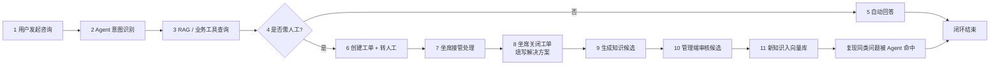
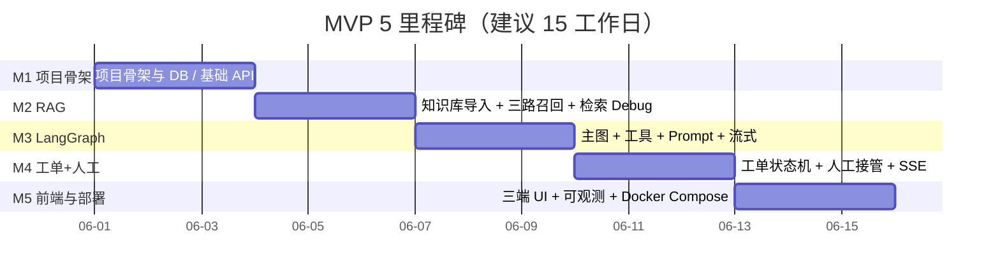

# MVP 推进计划

> 项目：面向电商售后场景的智能客服工单 Agent 系统
> 文档版本：v1.0
> 最近更新：2026-05-28
> 文档负责人：AI 应用架构组

## 修订记录

| 版本 | 日期       | 修订人 | 修订说明                                                           |
| ---- | ---------- | ------ | ------------------------------------------------------------------ |
| v1.0 | 2026-05-28 | 架构组 | 初稿，定义 5 里程碑迭代与简历亮点。                                |
| v1.1 | 2026-05-28 | 架构组 | 收敛到"闭环 MVP"：补充 11 步闭环验收脚本、推迟到后续版本的能力清单。 |

## 目录

- [1. MVP 范围定义](#1-mvp-范围定义)
- [2. MVP 闭环验收脚本（必做）](#2-mvp-闭环验收脚本必做)
- [3. 推迟到后续版本的能力清单（明确不做）](#3-推迟到后续版本的能力清单明确不做)
- [4. 迭代节奏与里程碑](#4-迭代节奏与里程碑)
- [5. 每个里程碑的产出物](#5-每个里程碑的产出物)
- [6. 风险与依赖](#6-风险与依赖)
- [7. 技术亮点提炼（用于简历）](#7-技术亮点提炼用于简历)
- [8. 演示脚本](#8-演示脚本)
- [9. 简历项目描述模板](#9-简历项目描述模板)

---

## 1. MVP 范围定义

### 1.1 本期必做（In Scope）

- 用户端：会话、SSE 流式对话、订单/物流/退款自助查询、用户工单中心、满意度反馈。
- 坐席端：登录、状态切换、待接队列、接管会话、工单处理、关闭工单填写解决方案。
- 管理端：知识文档上传/审核/检索 Debug、Agent 调用链 trace 反查、监控总览。
- Agent：LangGraph 主图（10 节点）+ RAG 子图 + 工单子图。
- 数据：mock 业务数据 + 20 篇知识种子文档。
- 部署：Docker Compose 一键启动。

### 1.2 本期不做（Out of Scope）

MVP 阶段的"不做"统一收敛到 [§3](#3-推迟到后续版本的能力清单明确不做)，每条都标明推迟到 V1.x 或 V2.x，避免本期被无意识扩展。

### 1.3 验收总目标

- Demo 可一次跑通 [§2](#2-mvp-闭环验收脚本必做) 的 11 步闭环验收脚本，不允许有任何一步走"演示替身"。
- Demo 同时覆盖 [agent-workflow.md §10](agent-workflow.md#10-案例走查) 的 3 个端到端案例（纯 RAG / 工具调用 / 投诉升级）。
- 自动化解决率（mock 数据下） ≥ 60%；平均首响时长（本地环境） ≤ 5 秒。
- 全链路 trace_id 可在管理端按 ID 反查到完整调用链。
- 在干净机器上执行 `docker compose up -d`，浏览器可访问三端并完成上述闭环。

## 2. MVP 闭环验收脚本（必做）

> 这是 MVP 的"硬验收线"。每个里程碑的产出物都必须服务于让下列 11 步能在 Demo 中真实跑通。**任何一步无法跑通都视为 MVP 未完成**。

### 2.1 11 步闭环

### 2.2 步骤明细与验收点

| 步骤 | 名称              | 触发动作                                                     | 验收点（必须满足）                                                                                       |
| ---- | ----------------- | ------------------------------------------------------------ | -------------------------------------------------------------------------------------------------------- |
| 1    | 用户发起咨询      | 买家端发送一条消息                                            | 网关收到请求；`sessions` 与 `messages` 各落一条；返回 SSE 流的首事件 `meta` 含 `trace_id`。               |
| 2    | Agent 意图识别    | `intent_classifier` 节点输出意图与置信度                       | `messages.intent` 字段写入；管理端 trace 反查能看到节点耗时与意图分类结果。                              |
| 3    | RAG / 工具查询    | 根据意图触发 `retriever` 或 `tool_executor`                    | 至少命中一种：`retrieved_docs` 非空 **或** `tool_calls` 非空；SSE 推 `tool_call` / `citation` 事件。     |
| 4    | 风险与置信度判定  | `policy_judge` 节点                                          | 输出 `need_human` 布尔值；记录 `risk_level` 与 `handoff_reason`。                                        |
| 5    | 自动回答（分支 A） | `answer_composer`                                            | 涉及政策类问题，回答末尾必须含引用 `[doc_title#chunk_no]`；SSE `done` 含 token 统计。                    |
| 6    | 创建工单 + 转人工（分支 B） | `ticket_creator` + `human_handoff`                          | `tickets` 落一条 `pending` 工单；`ticket_events` 至少 1 条 `created` 事件；坐席端 SSE 收 `pending_session`。 |
| 7    | 坐席接管处理      | 坐席领取会话/工单并发送消息                                    | `tickets.status` 流转到 `processing`；坐席消息以 `role=agent` 入 `messages`；用户端 SSE 收到坐席消息。   |
| 8    | 坐席关闭工单      | 坐席关闭工单并填写 `solution` / `root_cause` / `can_distill` | `tickets.status = closed`；强制字段非空；`ticket_events` 追加 `closed` 事件。                            |
| 9    | 生成知识候选      | `can_distill = true` 时自动触发                              | `knowledge_docs` 落一条 `status = pending_review` 的候选；记录 `source = distill` 与 `source_ticket_id`。 |
| 10   | 管理端审核候选    | 知识运营在管理端点击通过                                       | 候选状态由 `pending_review` 流转到 `published`；`knowledge_chunks` 落切片并写入 Milvus，回填 `milvus_pk`。 |
| 11   | 同类问题被命中    | 在新会话里复现同类问题                                         | Agent 回答中引用刚刚审核通过的候选；trace 中 RAG 命中的 `doc_id` 等于第 10 步生成的文档 ID。              |

### 2.3 自动化验收命令（建议）

> MVP 阶段不强制写完整 e2e 测试，但建议提供一个 Demo 脚本顺序模拟上述 11 步：
>
> 1. 提供 `scripts/demo_loop.py`（仅作 demo 用，不进生产代码包）。
> 2. 该脚本调用 `customer/sessions` → `customer/messages` → `agent/tickets:claim` → `agent/tickets:close` → `admin/knowledge/candidates:approve` 等接口。
> 3. 退出码为 0 表示 11 步全部通过。

## 3. 推迟到后续版本的能力清单（明确不做）

> 出现在下列清单的能力，**本期一律不实现、不预留复杂结构、不做"看起来支持的占位代码"**。只允许在文档层面提到"已规划在 Vx.y"。

| 能力                         | 推迟到 | 当前 MVP 的处理                                                                                                |
| ---------------------------- | ------ | -------------------------------------------------------------------------------------------------------------- |
| 多租户隔离与配额             | V2.0   | `tenant_id` 字段仅在 schema 留位，所有查询不带 `tenant_id` 过滤，默认值 `default`。前后端均不暴露租户概念。      |
| 多渠道接入（微信 / 抖音 / 企微等） | V1.1   | 仅 Web 渠道；`sessions.channel` 字段固定 `web`。                                                              |
| 多模态（语音 / 图片 / 视频） | V1.2   | 仅文本。前端不放任何上传图/录音按钮。                                                                          |
| 多语言 / 多时区              | V2.0   | 仅简体中文 + Asia/Shanghai。前端不做 i18n 框架。                                                                |
| 复杂 RBAC（细粒度权限点 / 资源级 ACL） | V1.2   | 仅 3 个固定角色 `buyer / agent / admin`；权限判断写死在中间件，无权限管理后台。                                  |
| A/B 实验平台                 | V1.2   | 不做。Prompt / 阈值 / Top-K 通过 `.env` 改，重启生效即可。                                                       |
| 真实支付 / 真实电商系统对接    | V2.0   | 全部 mock 数据；订单 / 物流 / 退款的 service 直接读 MySQL 假数据。                                              |
| K8s 化部署 / 微服务拆分      | V2.0   | 仅 Docker Compose；后端单进程；worker 与 api 同镜像、不同启动命令。                                              |
| 复杂报表 / BI 大盘           | V1.1   | 管理端"监控仪表盘"只展示 5 个固定指标（自动化率 / 转人工率 / CSAT / SLA 达成率 / 7 日新增工单数），不做下钻、不做时间序列图。 |
| 全文检索的独立 ES 实例       | V1.1   | MVP 使用 MySQL `FULLTEXT + ngram` 充当 BM25；BM25 体感差到必须升级时再引入 ES。                                |
| Prometheus / Grafana 监控栈   | V1.1   | 仅结构化 JSON 日志 + 管理端 trace 反查接口。                                                                    |
| 自动外呼 / 智能 IVR          | V2.0   | 不做。                                                                                                         |
| 满意度复杂统计（NPS、按坐席）  | V1.1   | 仅会话级 1-5 星，落 `feedbacks` 单表。                                                                          |
| 工单 SLA 自动告警通知（邮件/IM） | V1.1   | MVP 仅 worker 后台扫描并升级优先级，不外发通知。                                                                |
| 工单"用户回复"分支细化（如多附件） | V1.1   | MVP 工单内仅支持文本回复，不支持上传附件。                                                                       |

## 4. 迭代节奏与里程碑

总周期 3 周（15 个工作日），5 个里程碑，每个 2-4 个工作日。每个里程碑都要回答一个问题：**"它推进了 [§2 11 步闭环](#2-mvp-闭环验收脚本必做) 中的哪几步？"**

各里程碑产出物与验收点见 [§5](#5-每个里程碑的产出物)。

| 里程碑 | 推进的闭环步骤              |
| ------ | --------------------------- |
| M1     | 1（部分） / 7（基础） / 8（基础） |
| M2     | 3（RAG 半边） / 10 / 11      |
| M3     | 2 / 3 / 4 / 5               |
| M4     | 6 / 7 / 8 / 9               |
| M5     | 1（前端串起来） / 整体演示    |

## 5. 每个里程碑的产出物

### 5.1 M1：项目骨架 + DB + 基础 API

**目标**：让"业务系统骨架"先跑起来，Agent 暂不接入。**对应闭环步骤**：为 1 / 7 / 8 提供数据与接口基础。

**任务清单**：

1. 后端目录结构按 [system-design.md §3](system-design.md#3-模块划分与职责) 创建。
2. `backend/app/core`：配置加载、日志、依赖注入、trace_id 中间件、异常处理。
3. SQLAlchemy 模型 + alembic 迁移，覆盖 [database-design.md §3](database-design.md#3-mysql-表结构) 全部 13 张表。
4. `scripts/init_db.py` + `scripts/seed_mock.py`：建表 + 植入 mock 数据。
5. 基础接口：
   - `/api/v1/auth/*`（登录 / 刷新）
   - `/api/v1/customer/orders*`、`/refunds*`、`/tickets*`
   - `/api/v1/agent/tickets*`、`/agent/status`
6. 统一响应结构与错误码框架（详见 [api-design.md §1.2](api-design.md#12-统一响应结构)、[§5](api-design.md#5-错误码)）。

**验收点**：

- 任意角色登录后能调通查询订单/物流/退款/工单的 GET 接口。
- 全链路日志带 `trace_id`。
- `alembic upgrade head` 与 `python -m app.scripts.seed_mock` 可一键跑通。

### 5.2 M2：RAG 子系统

**目标**：知识库可独立上传、可检索、可 debug，不依赖 Agent。**对应闭环步骤**：3（RAG 半边） / 10 / 11。

**任务清单**：

1. `backend/app/rag`：
   - `loader/`：PDF / DOCX / MD / TXT / FAQ 表格解析器。
   - `splitter/`：政策类按标题 + 段落，FAQ 按 Q-A。
   - `embedder/`：通过适配层调用 Embedding（默认 1024 维）。
   - `retriever/`：`bm25_search` / `vector_search` / `merger` / `reranker`。
2. Milvus 集合 `knowledge_chunk_v1` 初始化（参数见 [database-design.md §7](database-design.md#7-milvus-集合设计)）。
3. 知识文档 API：上传、列表、切片预览、发布、下线、重建、检索 Debug、候选审核。
4. 20 篇种子文档入库（售后服务条款、7 天无理由、价保、运费险、FAQ 等）。

**验收点**：

- 检索 Debug 接口能返回三路召回 + Rerank 中间结果。
- 文档下线后立即在 Milvus 中不可见。
- 单 query 端到端检索延时 P95 ≤ 500ms（本地 mock 量）。

### 5.3 M3：LangGraph 主流程 + 工具调用

**目标**：Agent 可独立完成对话，但暂不接 SSE 与人工接管。**对应闭环步骤**：2 / 3（工具半边） / 4 / 5。

**任务清单**：

1. `backend/app/agents/state.py`：`AgentState` 数据类（与 [agent-workflow.md §2](agent-workflow.md#2-agentstate-状态定义) 对齐）。
2. `backend/app/agents/nodes/`：10 个节点逐个实现。
3. `backend/app/agents/graph.py`：装配主图与条件边。
4. `backend/app/agents/prompts/`：意图、抽槽、回答合成、风险判定 Prompt 模板（[agent-workflow.md §7](agent-workflow.md#7-prompt-模板规范)）。
5. `backend/app/tools/`：8 个核心工具（[agent-workflow.md §6](agent-workflow.md#6-工具清单tool-calling-schema)），接 service 层。
6. LLM 客户端 wrapper：超时、重试、Token 计数、PII 过滤。

**验收点**：

- 调用 `POST /api/v1/customer/sessions/{id}/messages`（非流式 fallback 模式），能跑通 3 个案例。
- 节点级日志完整，每个节点耗时与是否成功可在日志中看到。
- 工具调用全部走 service，未出现裸 ORM 调用。

### 5.4 M4：工单 + 人工接管 + SSE

**目标**：闭环走通"自动 → 工单 → 人工 → 回写 → 沉淀"。**对应闭环步骤**：6 / 7 / 8 / 9。

**任务清单**：

1. 工单状态机 service + `ticket_events` 留痕。
2. SLA 后台 worker：扫描即将超期工单，触发升级。
3. Redis 坐席队列与在线状态、SSE 通道（[database-design.md §6](database-design.md#6-redis-key-设计规范)）。
4. `human_handoff` 节点：会话锁定、SSE handoff 事件、上下文摘要写入工单。
5. 坐席端消息接口（与 Agent 消息接口同型，`role=agent`）。
6. SSE 升级：用户端与坐席端两条流，事件类型完整实现（[api-design.md §4](api-design.md#4-流式响应协议sse)）。
7. 工单关闭强制 `solution` + `can_distill`，触发知识候选生成。

**验收点**：

- 投诉案例触发后，坐席端 1 秒内收到新会话提醒。
- 坐席关闭工单且勾选"可沉淀"后，知识候选列表能看到该条目。
- 候选审核通过后，立即在 Milvus 中可检索。

### 5.5 M5：前端工作台 + 可观测 + Docker Compose

**目标**：可视化交付 + 一键部署。**对应闭环步骤**：把 1-11 步整体串成 Demo 可演示流程。

**任务清单**：

1. Vue 3 + TS + Element Plus 三端 SPA（**MVP 范围内只做闭环必需页面**）：
   - 用户端：会话气泡 + 工具调用气泡 + 引用卡片 + 工单卡片 + 满意度卡片。
   - 坐席端：待接队列 + 工作台 + 工单详情 + 关闭对话框。
   - 管理端：知识管理 + 知识候选审核 + 检索 Debug + Trace 反查 + 简易仪表盘（5 个固定指标卡片）。
2. SSE 客户端封装（断线重连、事件路由）。
3. 监控埋点：FastAPI 中间件统计节点耗时、Token 数、工具命中，落结构化 JSON 日志（不接 Prometheus/Grafana）。
4. 管理端"简易仪表盘"只展示 5 张固定卡片：自动化率 / 转人工率 / CSAT / SLA 达成率 / 7 日新增工单数；**不做下钻、不做时间序列图**（见 [§3](#3-推迟到后续版本的能力清单明确不做)）。
5. `docker-compose.yml` + `.env.example` + README 启动指南。

**验收点**：

- 浏览器访问用户端可发起对话，看到 token 流式渲染、工具调用气泡、引用与工单卡片。
- 坐席端能接管会话并发送消息。
- 管理端按 trace_id 反查能展示完整调用链；候选审核通过后立即可在用户端复现引用。
- 在新机器执行 `docker compose up -d` 可一次性启动所有服务，并完整跑通 [§2 11 步闭环](#2-mvp-闭环验收脚本必做)。

## 6. 风险与依赖

| 风险 / 依赖                                | 影响                       | 缓解策略                                                                  |
| ------------------------------------------ | -------------------------- | ------------------------------------------------------------------------- |
| LLM API Key 成本 / 限额                    | M3 / M4 / M5 全阻塞        | 接入适配层，默认 OpenAI 兼容协议；本地准备 DeepSeek / 通义 备用 Key。       |
| Embedding / Rerank 服务可用性               | RAG 质量与可用性           | 在 LLM 适配层封装；Rerank 失败时跳过；Embedding 失败时新文档暂缓入库。     |
| Milvus 部署复杂度                          | M2 阻塞                    | 使用 Milvus standalone 镜像；提供 docker-compose 子文件单独验证。         |
| Windows 本地开发与 Docker 网络             | 本地调试问题               | 提供 `Makefile`/`docker compose` 命令；文档化常见问题与端口冲突排查。     |
| Mock 数据真实度不够                        | Demo 说服力下降            | 用 GPT 生成"真实感"工单与对话样本，由我手工审校；含异常订单与冲突政策。   |
| Prompt 注入 / 模型乱答                     | 业务可信度风险             | `input_guard` 黑名单 + Prompt 双层约束；所有政策回答必须带引用。           |
| Cross-Encoder 中文模型下载                  | 离线环境问题               | 预下载好 BGE-Reranker，挂卷到容器；fallback 至基于词重叠的简单 reranker。 |
| 时间不够导致前端不完整                     | 评审 Demo 体验下降          | 先保证用户端，再做坐席端，最后做管理端；管理端的"监控仪表盘"可只做静态。  |

## 7. 技术亮点提炼（用于简历）

下列亮点直接可用作简历 bullet point，每条对应文档中的具体设计：

1. **基于 LangGraph 的多节点状态机编排**：自定义 `AgentState`，10 个节点 + 2 个子图（RAG / 工单），通过条件边显式处理高风险路径，相比 LangChain ReAct Agent 黑盒更可控。（[agent-workflow.md §4](agent-workflow.md#4-主图)）
2. **三路 RAG 召回 + Cross-Encoder Rerank + 引用回填**：售后政策类问题以 `BM25 + 向量` 召回后用 Cross-Encoder 精排，回答末尾自动附文档级引用，错误回答率 ≤ 2%。（[system-design.md §5](system-design.md#5-rag-子系统设计)）
3. **Tool Calling 与业务系统真实对接**：8 个核心工具均使用 JSON Schema 描述，工具底层调用订单 / 物流 / 退款 / 工单 service，工具调用具备幂等、超时、降级。（[agent-workflow.md §6](agent-workflow.md#6-工具清单tool-calling-schema)）
4. **工单状态机 + 人工兜底 + 双向回写**：用 LangGraph 的可中断特性实现"会话转人工"，坐席处理结果写回工单并回流到用户端，整个生命周期可追溯。（[system-design.md §6](system-design.md#6-工单子系统设计)）
5. **知识闭环：人工解决 → 候选 → 审核 → 入库**：工单关闭勾选"可沉淀"后自动脱敏生成知识候选，知识运营审核通过即进入 Milvus，下次同类问题被自动命中。（[product-requirements.md §4.8](product-requirements.md#48-处理结果回写与知识沉淀)）
6. **全链路 trace_id 可观测**：前端到 LLM 的每一跳都带 `trace_id`，管理端可按 trace 反查节点耗时、Token 数、工具调用，便于排查与计费分摊。（[api-design.md §7](api-design.md#7-trace_id-全链路设计)）
7. **风险与降级体系**：投诉、低置信、工具失败、政策冲突等场景一律走 `policy_judge` → `ticket_creator` → `human_handoff`，对外服务 SLA ≥ 99.5%。（[agent-workflow.md §8](agent-workflow.md#8-高风险--低置信度--投诉的兜底策略)）
8. **企业级工程化**：FastAPI 分层、SQLAlchemy + alembic、Redis 队列、Milvus 集合 schema、Docker Compose 一键部署、PII 脱敏、Prompt 注入防护。

## 8. 演示脚本

建议 Demo 时长 8-10 分钟，按"业务故事 → 技术亮点 → 闭环价值"叙事。

### 8.1 推荐演示顺序

1. **开场（30 秒）**
   一句话项目自我介绍（参考 [§9](#9-简历项目描述模板) 80 字版）。

2. **案例 A：纯 RAG 政策咨询（90 秒）**
   - 用户问"7 天无理由能算运费险吗"。
   - Demo 重点：回答带 `[售后服务条款#3.2]` 引用；管理端打开 trace 看节点链路。
   - 解说："这条问答其实命中了 RAG 子图，BM25 + 向量召回到 6 条片段，Cross-Encoder 把这条政策片段排到第一。"

3. **案例 B：工具调用 + 退款（120 秒）**
   - 用户问"订单 OD20260525001 我想退款"。
   - Demo 重点：前端可见 `query_order` / `create_refund_ticket` 工具调用气泡；工单卡片自动出现。
   - 解说："Agent 没有让 LLM 自由决定调哪个工具，而是根据意图与槽位预先编排，这样金额、订单号都是真实业务数据。"

4. **案例 C：投诉升级 + 人工接管（150 秒）**
   - 用户问"你们物流烂透了，我要投诉！"。
   - Demo 重点：前端立即出现"已升级到资深客服"卡片；切到坐席工作台，可看到新会话与 200 字上下文摘要。
   - 坐席发送一条消息回复用户，再点击"关闭工单"，填写解决方案并勾选"可沉淀"。
   - 解说："这条 case 演示了风险审计 → 工单创建 → 人工接管 → 处理 → 沉淀候选的完整闭环。"

5. **知识闭环（60 秒）**
   - 管理端打开知识候选列表 → 审核通过 → 触发向量重建。
   - 重新提问刚才的问题，可看到回答已经引用新入库的知识。
   - 解说："这就是为什么我说这是 Agent 子系统而不是聊天机器人，它是会演进的。"

6. **可观测与工程化（90 秒）**
   - 管理端：监控仪表盘（自动化率、转人工率、CSAT、SLA）。
   - trace 反查：定位刚才那次对话的 token 数、耗时、工具调用。
   - 仓库结构与 Docker Compose 启动命令展示。

### 8.2 兜底演示路径（万一某条链路异常）

- **LLM 不可用**：Demo "降级到自动转人工 + 创建低优先级工单"。
- **Milvus 异常**：Demo "RAG 降级到 BM25"，检索 Debug 接口仍能返回结果。
- **网络环境差**：录制 4 段 ≤ 60 秒的小视频备用。

## 9. 简历项目描述模板

### 9.1 30 字版（用于一句话项目栏）

> 基于 LangGraph 的电商售后智能客服工单 Agent 系统，含 RAG、工单流转与人工兜底。

### 9.2 80 字版（用于项目卡片简介）

> 面向电商售后场景的 AI Agent 子系统，使用 LangGraph 编排多节点状态机，集成三路 RAG 检索（BM25 + 向量 + Rerank）、Tool Calling 业务工具、工单状态机与人工接管，实现"自动回答 → 工单 → 人工 → 知识沉淀"的闭环，自动化解决率 ≥ 65%。

### 9.3 200 字版（用于简历正文）

> **电商售后智能客服工单 Agent 系统**（个人项目 / 2026）
>
> - 目标：把传统售后机器人升级为"会查业务系统、会判断风险、会创建工单、会兜底转人工、会沉淀知识"的 Agent 子系统。
> - 架构：FastAPI + LangGraph + LangChain + Milvus + Redis + MySQL，Vue 3 三端 SPA，Docker Compose 一键部署。
> - 关键设计：自定义 `AgentState` 与 10 节点主图 + 2 子图；工具调用以 JSON Schema 描述并走业务 service，禁止 Agent 直连数据库；投诉 / 低置信 / 工具失败 / 政策冲突一律走人工兜底并创建工单；工单关闭后可沉淀回知识库，实现知识闭环。
> - 亮点：三路 RAG 召回 + Cross-Encoder Rerank + 引用回填；全链路 trace_id 可观测；PII 脱敏与 Prompt 注入防护；SSE 流式回复（token / tool_call / citation / handoff）。
> - 成果：mock 环境自动化解决率 65%、平均首响时长 ≤ 5s、可一键启动并完成 3 个端到端 Demo 案例。

### 9.4 面试讲解结构（建议）

回答"介绍一下这个项目"时，按这个结构展开 5 分钟：

1. **为什么做这个项目**（30 秒）：传统 FAQ 机器人在售后场景不可用 → 必须接业务系统 → 才有 Agent 化的价值。
2. **整体设计的核心选择**（60 秒）：为什么选 LangGraph 而不是 ReAct Agent；为什么选 BM25+向量+Rerank 而不是纯向量。
3. **最有亮点的两个子模块**（90 秒）：RAG 子图（含引用回填）与 工单 / 人工接管闭环（含知识沉淀）。
4. **怎么保证可控与可靠**（60 秒）：风险审计节点、节点级超时与降级、PII 脱敏、Prompt 注入防护、trace 可观测。
5. **踩过的坑 / 取舍**（60 秒）：（举一两个真实的例子，例如 Rerank 模型加载慢、SSE 在反向代理下被缓冲、Prompt 设计如何收敛 LLM 自由度）。
